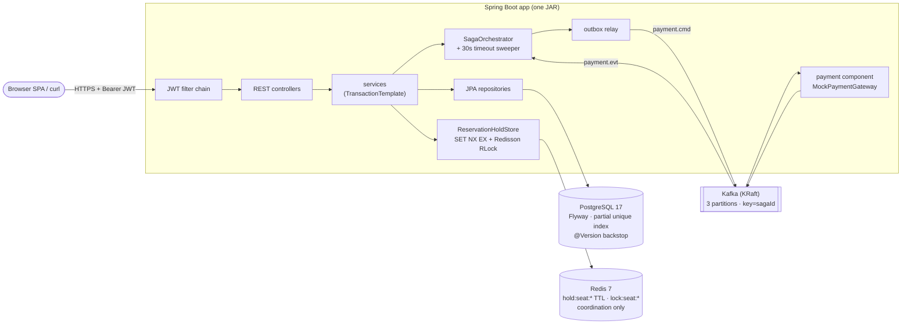
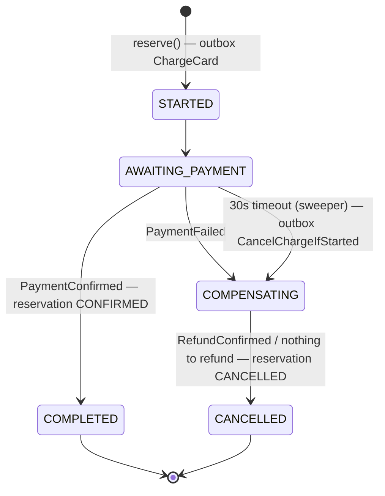
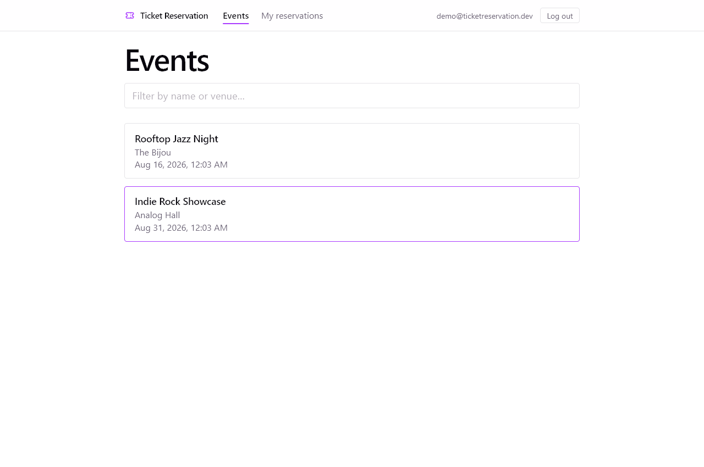
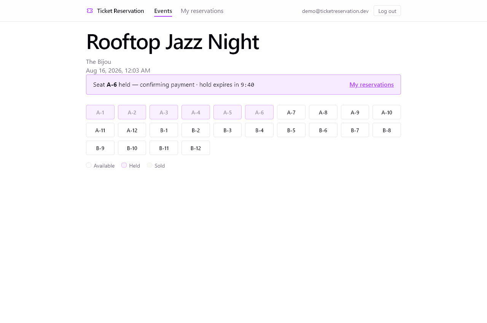
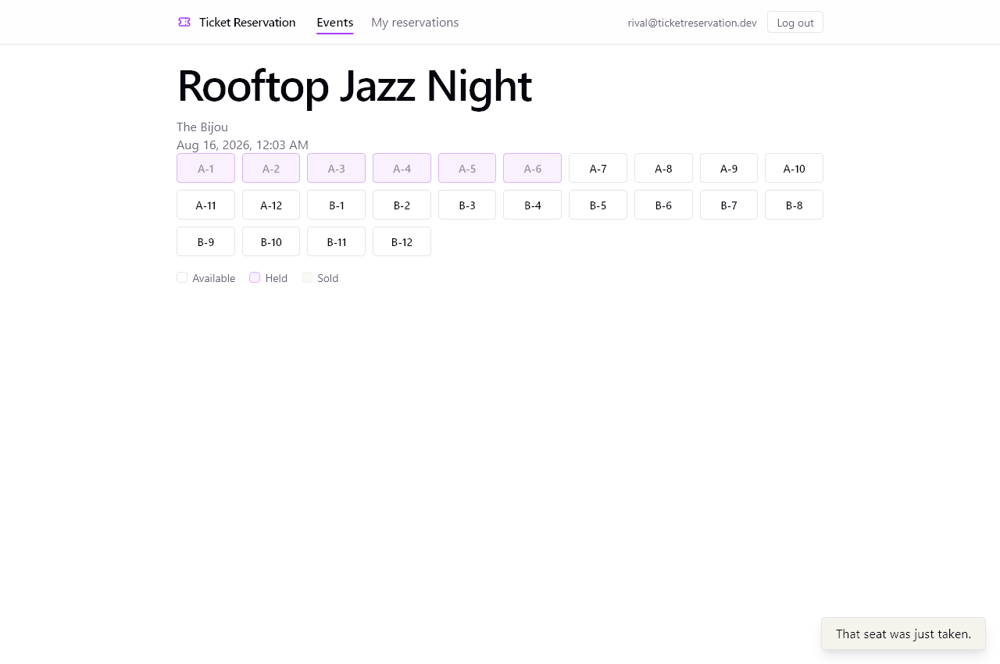
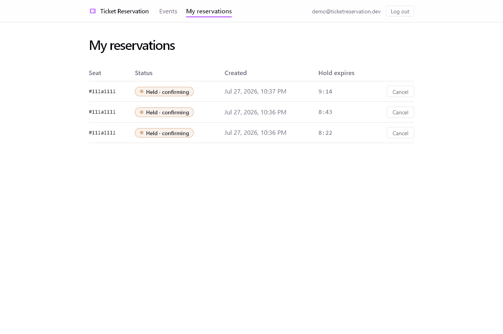

# Event Ticket Reservation System

A Spring Boot event ticketing service handling concurrent seat reservations with cross-JVM coordination: Redis-native TTL holds, a Redisson distributed lock for hot-event contention, and a Postgres `@Version` + partial unique index backstop. Built as an interview portfolio piece.

**Live demo:** [https://ticket-reservation-production-7193.up.railway.app](https://ticket-reservation-production-7193.up.railway.app)
**Repo:** [github.com/EthanLuong/ticket-reservation](https://github.com/EthanLuong/ticket-reservation)

---

## Status

**Phase 2a (payment saga over Kafka) — feature-complete on `phase-2a-payment-saga`.** Orchestrated booking saga (reserve → charge → confirm/compensate) via transactional outbox, idempotent consumers, DLT poison-pill handling, and an `Idempotency-Key` contract on the reserve endpoint. Design records: [ADR 0003](docs/adr/0003-event-typing.md) (wire format), [ADR 0007](docs/adr/0007-saga-messaging-outbox-orchestration-dlt.md) (outbox/orchestration/ordering/DLT), [ADR 0008](docs/adr/0008-deliberately-not-transactional.md) (deliberate non-transactionality).

**Phase 1 (Redis holds + distributed lock) — SHIPPED.** Reservation TTL is now Redis-native (atomic `SET NX EX`), critical sections are wrapped in a Redisson `RLock` for cross-JVM serialization, and the `@Scheduled` Postgres sweeper has been retired in favor of two-path lazy reconciliation. Failure-closed (503) on Redis outage — see [`docs/adr/0002-redis-for-holds-and-locks.md`](docs/adr/0002-redis-for-holds-and-locks.md) for the design decisions.

**Phase 0 (reservation foundation) — SHIPPED.** Single-service reservation system with JWT auth, optimistic-locked seat holds, and Testcontainers-proven race invariants. Deployed on Railway with managed Postgres.

Phased roadmap (Phase 1–5) below.

---

## Quick start

### Option A — Docker Compose (prod-parity local)

```bash
docker compose up --build
```

Spins up Postgres 17-alpine + Redis 7-alpine + the service, gated on healthchecks for both. App listens on `http://localhost:8080`. Health probe:

```bash
curl http://localhost:8080/actuator/health
# {"status":"UP"}    # 200 when Postgres + Redis are both up
```

If Redis is unreachable, reservation endpoints return 503 with a retryable `ProblemDetail`; reads (events, seats) continue to work since they don't touch Redis.

### Option B — Maven dev loop (fastest)

Requires Docker Desktop running (for the Testcontainers-backed dev Postgres).

```bash
./reservation-service/mvnw spring-boot:test-run    # dev run, auto-provisions Testcontainers Postgres
./reservation-service/mvnw verify                  # full test suite + package
```

The `test-run` goal auto-wires a disposable Postgres container via `@ServiceConnection`, so no manual DB setup is needed.

---

## Architecture

One deployable today, two backing stores (Postgres = system of record, Redis = ephemeral coordination), Kafka carrying the payment saga between the reservation side and the payment component. The component boundary is already event-only — the [refocus design](docs/REFOCUS-DESIGN.md) splits it into a real second service.



### Where this is going — refocus target ([design](docs/REFOCUS-DESIGN.md))


Two services sharing nothing but Kafka topics and the event contract; each owns its database, dedup table, and outbox; one `sagaId` traces a booking across both in Kibana.

### Domain

```
Event  1───N  Seat  1───N  Reservation  N───1  User
                                status ∈ {HELD, CONFIRMED, EXPIRED, CANCELLED}
```

Full schema: [`reservation-service/src/main/resources/db/migration/V1__init.sql`](reservation-service/src/main/resources/db/migration/V1__init.sql).

### Reservation flow (Phase 1)

```
reserve(userId, seatId)
  ├─ withSeatLock(seatId) — Redisson tryLock(100ms wait, 2s lease)
  │      └─ contention → SeatContentionException → 409 (retryable=true)
  │
  ├─ tryHold(seatId, reservationId, 10min) — SET NX EX hold:seat:{id}
  │      └─ collision → SeatNotAvailableException → 409
  │
  ├─ TransactionTemplate.execute:
  │      ├─ load seat from Postgres
  │      ├─ if seat.status == HELD → reconcile stale rows to EXPIRED, continue
  │      ├─ flip seat.status = HELD, save (saveAndFlush — @Version checked)
  │      └─ insert reservation row (id pre-assigned by service)
  │
  └─ on tx exception → holdStore.release(seatId)  (compensating DEL)
```

Cancellation mirrors the structure: lock → tx (set CANCELLED, free seat) → DEL Redis hold key after commit.

`myReservations()` lazily reconciles HELD-with-no-Redis-key rows to EXPIRED on read — replaces the retired `@Scheduled` sweeper.

### Saga flow (Phase 2a)

Reserving now also starts a booking saga: the reservation transaction writes a `Saga` row and a `ChargeCard` command into the **transactional outbox** (same Postgres commit — no dual-write window); a relay publishes outbox rows to Kafka; the payment component charges and replies; the orchestrator drives the state machine to a terminal state.



Messages ride a generic envelope keyed by `sagaId` (per-saga total order — [ADR 0003](docs/adr/0003-event-typing.md)); delivery is **at-least-once + idempotent consumers** (dedup on `eventId`), never a claimed "exactly-once"; unprocessable records go to `<topic>.DLT` after 3 attempts ([ADR 0007](docs/adr/0007-saga-messaging-outbox-orchestration-dlt.md)).

**Idempotency is layered — three nets, different failure modes:** the REST `Idempotency-Key` (required on `POST /api/reservations`) dedups client retries and replays the original response; each Kafka consumer's `processed_events` table dedups redelivered messages; the Redis seat hold blocks a second hold on the same seat. Any one alone leaves a gap the others close.

---

## API reference

All endpoints are JSON. Protected endpoints require `Authorization: Bearer <token>` obtained from `/api/auth/login`.

### Auth

| Method | Path | Auth | Purpose |
|---|---|---|---|
| `POST` | `/api/auth/register` | Public | Create account, returns JWT |
| `POST` | `/api/auth/login` | Public | Exchange credentials for JWT |

### Events (read-only, public)

| Method | Path | Purpose |
|---|---|---|
| `GET` | `/api/events?page=0&size=20` | Paged list of upcoming events |
| `GET` | `/api/events/{id}` | Single event by ID |

### Seats (read-only, public)

| Method | Path | Purpose |
|---|---|---|
| `GET` | `/api/seats?eventId={uuid}&status={AVAILABLE\|HELD\|SOLD}` | Seats for an event; `status` filter optional |

### Reservations (JWT required)

| Method | Path | Purpose |
|---|---|---|
| `POST` | `/api/reservations` | Hold a seat (body: `{"seatId":"<uuid>"}`). **Requires `Idempotency-Key` header** (client-minted UUID per checkout attempt, reused across retries of it); returns `201`. Duplicate in flight → `409` + `Retry-After`; completed duplicate → original response replayed verbatim; key reuse with different body → `422` |
| `DELETE` | `/api/reservations/{id}` | Cancel own reservation, release seat |
| `GET` | `/api/reservations/me` | List caller's reservations |

### Operational

| Method | Path | Purpose |
|---|---|---|
| `GET` | `/actuator/health` | Liveness probe |
| `GET` | `/actuator/info` | Build info |

### Example: full booking flow

```bash
BASE=https://ticket-reservation-production-7193.up.railway.app

# 1. Register
TOKEN=$(curl -s -X POST $BASE/api/auth/register \
  -H "Content-Type: application/json" \
  -d '{"email":"demo@example.com","password":"password12345","displayName":"Demo"}' \
  | jq -r .token)

# 2. Pick an event + seat
EVENT_ID=$(curl -s $BASE/api/events | jq -r '.content[0].id')
SEAT_ID=$(curl -s "$BASE/api/seats?eventId=$EVENT_ID&status=AVAILABLE" | jq -r '.[0].id')

# 3. Reserve (Idempotency-Key is required — mint one per checkout attempt,
#    reuse it when retrying the SAME attempt: the retry replays, never double-books)
curl -X POST $BASE/api/reservations \
  -H "Authorization: Bearer $TOKEN" \
  -H "Content-Type: application/json" \
  -H "Idempotency-Key: $(uuidgen)" \
  -d "{\"seatId\":\"$SEAT_ID\"}"
```

Error responses follow [RFC 7807](https://www.rfc-editor.org/rfc/rfc7807) (`application/problem+json`). Headline cases:

| Status | `type` slug | When | Client action |
|---|---|---|---|
| `409` | `seat-not-available` | Seat is currently held by another user | Pick another seat |
| `409` | `seat-contention` | Another reserve/cancel for this seat is in flight (Redisson lock contention) | **Auto-retry** — `retryable: true` flag set |
| `409` | `optimistic-lock` | DB-level `@Version` race lost (rare under Phase 1's lock + TTL) | Refresh state, retry |
| `503` | `redis-unavailable` | Redis is unreachable — coordination layer is down | Retry after `retryAfterSeconds` (5s) |
| `409` | *(no problem body)* | Same `Idempotency-Key` still in flight — the bare body is the discriminator vs the typed 409s above | Retry after `Retry-After` (2s) with the **same** key |
| `422` | *(no problem body)* | `Idempotency-Key` reused with a different request body | Client bug — mint a fresh key |

Example for the double-book attempt:

```json
{
  "type": "https://ticket-reservation.example/errors/seat-not-available",
  "title": "Seat not available",
  "status": 409,
  "detail": "Seat 9c8f... is not available",
  "seatId": "9c8f..."
}
```

Example for Redis outage:

```json
{
  "type": "https://ticket-reservation.example/errors/redis-unavailable",
  "title": "Service temporarily unavailable",
  "status": 503,
  "detail": "Reservation service is temporarily unavailable. Please retry shortly.",
  "retryable": true,
  "retryAfterSeconds": 5
}
```

---

## Design decisions

Phase 2a's decisions are recorded as ADRs rather than repeated here: [0003 event typing](docs/adr/0003-event-typing.md) · [0007 outbox / orchestration / ordering / DLT](docs/adr/0007-saga-messaging-outbox-orchestration-dlt.md) · [0008 deliberately not transactional](docs/adr/0008-deliberately-not-transactional.md). The numbered items below are Phase 0/1.

### 1. Three-layer concurrency defense (not one)

Booking the same seat from multiple clients at the same instant must allow **exactly one** to win. I layered three independent defenses, each catching a different race class:

| Layer | Check | Race class caught |
|---|---|---|
| 1. App-layer fast-fail | `seat.status == AVAILABLE` at service entry | Naive sequential double-book |
| 2. JPA optimistic lock | `@Version` bump fails on concurrent commit | Two threads both passed the status check |
| 3. Partial unique index | `CREATE UNIQUE INDEX ... WHERE status IN ('HELD','CONFIRMED')` | Any race that bypasses Hibernate (bulk SQL, manual insert) |

Layer 1 is cheap and catches the normal case. Layer 2 is the primary correctness guarantee. Layer 3 is a DB-level backstop — interviewers specifically ask *"what if the app is bypassed?"*

**Non-obvious gotcha I hit:** Hibernate flushes INSERTs before UPDATEs by default. Without `saveAndFlush(seat)` before the reservation insert, the partial unique index would catch the race *before* `@Version` had a chance to fire — masking the optimistic-lock design. `saveAndFlush` inverts the flush order so `@Version` is the primary catcher, as intended.

### 2. Partial unique index over CHECK constraint

The "one active reservation per seat" rule could be a CHECK constraint or a unique index. I chose a **partial unique index on `seat_id WHERE status IN ('HELD','CONFIRMED')`** because:

- CHECK can't enforce cross-row uniqueness (it's a per-row predicate).
- Partial unique index preserves history: expired and cancelled rows stay in the table and don't compete.
- B-tree lookups for the active-reservation check use the index, so reads are also faster.

### 3. Java-side `@PreUpdate` for `updated_at` (not a DB trigger)

Two common ways to keep `updated_at` fresh on every update: DB trigger or JPA lifecycle callback. I chose `@PreUpdate`:

- Simpler deploy — no trigger install/rollback to manage.
- Works identically across Testcontainers-Postgres and production.
- **Known tradeoff:** doesn't fire on JPQL bulk `UPDATE` statements. Acceptable for Phase 0 — no bulk updates in the code path. If bulk operations are added later (e.g., expiry sweep rewritten as one bulk UPDATE), this moves to a trigger.

### 4. JWT stateless auth, no server-side session

`/api/auth/login` returns a JWT signed with HS256. The auth filter validates signature + expiry on each request and populates `SecurityContext`. No session store.

- Works across horizontal scale without sticky sessions or a session DB.
- Secret sourced from `APP_SECURITY_JWT_SECRET` env var, ≥32 bytes for HS256 key-length requirement.
- Rotation is a Phase 4 concern.

### 5. `ddl-auto=validate` + Flyway owns schema

`spring.jpa.hibernate.ddl-auto=validate` means Hibernate does not mutate the schema — it only verifies that entities and tables match. Flyway V1 migration is the source of truth.

- Catches entity/schema drift at startup — app fails to boot rather than silently emitting malformed SQL.
- Makes schema changes auditable (one migration file per change, version-controlled).
- Validated in CI: startup itself is the smoke test.

### 6. Phase 1 — Redis for coordination, Postgres for system of record

Full rationale in [`docs/adr/0002-redis-for-holds-and-locks.md`](docs/adr/0002-redis-for-holds-and-locks.md). Headline decisions:

- **Two-layer Redis**: `SET NX EX` for the TTL hold (atomic, 10 min business duration) and Redisson `RLock` for the critical-section lock (2 s lease, prevents wasted work on hot events). Both are needed — the SET NX gives correctness, the RLock gives efficiency.
- **Drop the `@Scheduled` sweeper**: Redis-native TTL replaces it. Stale rows are reconciled on-the-fly inside `reserve()` (under the RLock) and lazily inside `myReservations()` (on user read). Self-healing without a polling thread.
- **Per-seat lock granularity**: `lock:seat:{id}`, not per-event. Two reservations for two different seats in the same event don't serialize.
- **Fail-closed on Redis outage** (503 SERVICE_UNAVAILABLE): a fall-back-to-DB-only path would lose cross-JVM serialization and permit double-holds. Better to refuse service. Verified by `RedisOutageIT`.
- **Single-node Redis** (Upstash managed) for Phase 1; Redlock multi-node hardening deferred to Phase 4+ if real load measurements justify it.

### 7. `Persistable<UUID>` + drop `@GeneratedValue` for pre-assigned reservation ids

Phase 1's "Redis-first ordering" needs the reservation id **before** the DB insert (so the id can be the Redis value at `SET NX EX` time). Pre-assigning a UUID to a Hibernate entity with `@GeneratedValue(strategy = UUID)` triggered both Spring Data's "is this new?" heuristic AND Hibernate's transient-vs-detached classifier — two independent layers that needed to agree. The fix:

```java
@Id
@Column(columnDefinition = "uuid", updatable = false, nullable = false)
private UUID id;          // no @GeneratedValue

// + implements Persistable<UUID> with @Transient boolean isNew flag
```

Drops `@GeneratedValue` (so Hibernate doesn't classify pre-set ids as detached) and implements `Persistable` (so Spring Data routes to `persist()`, not `merge()`). Four rounds of failure (StaleObjectStateException → PersistentObjectException → still PersistentObjectException with Persistable alone → finally INSERT works once `@GeneratedValue` is dropped) before the right combination clicked — interview-grade JPA gotcha story.

---

## Testing

### Concurrency invariant — the headline test

[`SeatReservationConcurrencyIT`](reservation-service/src/test/java/com/ethanluong/ticketreservation/SeatReservationConcurrencyIT.java) races 10 threads at the same seat through a `CountDownLatch` start-gate, then asserts:

- Exactly one `Outcome.SUCCESS`
- Zero `Outcome.FAILURE_OTHER` (unexpected errors)
- Single reservation row in DB
- Seat final state: `HELD`, `version == 1`

Categorized outcomes distinguish app-layer losses (`FAILURE_NOT_AVAILABLE`) from DB-layer losses (`FAILURE_OPTIMISTIC_LOCK`, `FAILURE_DATA_INTEGRITY`), proving which layer caught each racing thread. Ran 50× clean — invariant is stable, not flaky.

### Phase 1 Redis tests

| Test class | What it verifies |
|---|---|
| [`RedisTTLHoldIT`](reservation-service/src/test/java/com/ethanluong/ticketreservation/RedisTTLHoldIT.java) | `reserve()` writes `hold:seat:{id}` with TTL ≈ 600s; collision blocks second reserve; `cancel()` releases the key; on-the-fly + lazy reconciliation paths |
| [`RedissonLockContentionIT`](reservation-service/src/test/java/com/ethanluong/ticketreservation/RedissonLockContentionIT.java) | `reserve()` fast-fails with `SeatContentionException` (<500ms) when the `RLock` is held on a different thread; succeeds normally once released |
| [`RedisOutageIT`](reservation-service/src/test/java/com/ethanluong/ticketreservation/RedisOutageIT.java) | `@MockitoBean RedissonClient` injects connection failure; asserts exception bubbles to handler, zero DB drift, 503 ProblemDetail mapping |

### Stack

- JUnit 5 + AssertJ
- Testcontainers with `@ServiceConnection` for both Postgres 17-alpine and Redis 7-alpine
- `@MockitoBean` (Spring Framework 6.2+) for failure injection
- No H2, no mocks for DB-backed behavior — Testcontainers because H2's partial index and `gen_random_uuid()` don't match Postgres semantics

Run the full suite (17 tests across 6 classes):

```bash
./reservation-service/mvnw verify
```

---

## Tech stack

- **Runtime:** Java 21, Spring Boot 4.0.x
- **Data:** PostgreSQL 17-alpine, Flyway migrations, Spring Data JPA (Hibernate)
- **Coordination:** Redis 7-alpine, Spring Data Redis (Lettuce) for TTL holds, Redisson 3.50.0 for distributed locks
- **Security:** Spring Security 6, jjwt 0.12.x
- **Testing:** JUnit 5, AssertJ, Testcontainers, `@MockitoBean` for failure injection
- **Packaging:** Multi-stage Dockerfile (Java 21 JDK builder → JRE-alpine runtime)
- **Deploy:** AWS — ECS Fargate behind ALB, RDS Postgres, ElastiCache Redis, self-managed Kafka (KRaft) on EC2, CloudFront two-origin (see `docs/aws/DEPLOY-HANDBOOK.md`)
- **Build:** Maven (via `mvnw`)

---

## Roadmap

| Phase | Scope | Status |
|---|---|---|
| **0. Reservation foundation** | Entities, JWT auth, `@Version` optimistic lock, partial-index backstop, Testcontainers race proof | ✅ Shipped |
| **1. Redis holds + distributed lock** | Redis-native TTL holds, Redisson `RLock` per seat, lazy reconciliation, fail-closed (503) on Redis outage | ✅ Shipped |
| **2a. Payment saga over Kafka** | Transactional outbox → topics → idempotent consumers → DLT; orchestrated state machine + timeout compensation; REST `Idempotency-Key` | ✅ Shipped (merged 2026-08-21) |
| **Frontend** | React 19 SPA: auth, events, seat grid with live hold countdown + saga status | ✅ Shipped |
| **AWS deploy** | VPC, ECS Fargate ×2, RDS, ElastiCache, KRaft on EC2, SSM secrets, CloudFront | ✅ Live |
| **R1–R2. Microservice split** | Own the container stack; extract `payment-service` (own DB, own outbox) — [refocus design](docs/REFOCUS-DESIGN.md) | ▶ Active |
| **R3. ELK logging** | JSON logs + `sagaId` correlation → Filebeat → Logstash → Elasticsearch → Kibana | Planned |
| **R4. Surface** | Target-architecture README, AWS redeploy of the two-service shape, CI/CD | Planned |
| **Parked** | Rate limiting, circuit breaker, caching, tickets/QR, refunds, group bookings, load tests | Backlog |

Each phase ships polished — deployed, tested, documented. At any checkpoint there is an interview-ready artifact.

---

## Env vars

Required at runtime:

| Variable | Purpose |
|---|---|
| `SPRING_DATASOURCE_URL` | JDBC URL — must start with `jdbc:postgresql://` |
| `SPRING_DATASOURCE_USERNAME` | DB user |
| `SPRING_DATASOURCE_PASSWORD` | DB password |
| `SPRING_DATA_REDIS_URL` | Redis connection — `redis://host:port` for plaintext, `rediss://host:port` for TLS (prod ElastiCache with transit encryption). Defaults to `redis://localhost:6379` for local dev. |
| `APP_SECURITY_JWT_SECRET` | HS256 signing key, ≥32 bytes |
| `SERVER_PORT` | On Railway/Fly, bind to `${PORT}` |

Local dev via `docker compose up` supplies all of these with sane defaults. A dev JWT secret is baked into `application.properties` — **never use it in production**.

## Frontend

A React 19 + TypeScript + Tailwind v4 SPA lives in `frontend/` — login/register, an events list, seat selection with a live hold countdown, and an account page for managing reservations. It talks to the backend over the REST API documented above.

### Running it locally

1. **Backend + Postgres + Redis** (Docker Compose):

   ```bash
   docker compose up -d
   ```

   If you change backend code (e.g. `SecurityConfig` CORS), rebuild the app image with `docker compose up -d --build app`.

2. **Seed data** — there is no event-creation endpoint (`EventController` is read-only), so a fresh database has nothing to browse. Load the dev seed (2 events, 36 seats total) with:

   ```bash
   docker compose exec -T db psql -U postgres -d ticketreservation < scripts/dev-seed.sql
   ```

   Safe to re-run — every row uses a fixed UUID + `ON CONFLICT (id) DO NOTHING`.

   *(Alternative to step 1+2: `./reservation-service/mvnw spring-boot:run` against a Postgres/Redis you already have running, then apply the seed the same way.)*

3. **Frontend dev server:**

   ```bash
   cd frontend
   npm install
   npm run dev
   ```

   Opens on `http://localhost:5173`. The backend's CORS config already allows this origin for `/api/**` (see `SecurityConfig.corsConfigurationSource()`) — no extra setup needed as long as the backend is reachable at `http://localhost:8080` (the default in `frontend/.env.development`).

### Two-browser demo script

Shows off the concurrency guarantees from a real browser, not just curl:

1. Open the app in two browsers (or one normal + one incognito window) — call them **A** and **B**. Register/log in as two different users, then navigate both to the **same event**.
2. In **A**, click an available seat.
   - A gets a **hold banner** at the top of the page with a live countdown (10 minutes), and the seat flips to "held" in the grid.
3. In **B**, click the **same seat** (before A's hold expires).
   - B gets a **contention/unavailable toast** (`"Someone beat you to that seat — pick another."` or `"That seat was just taken."` depending on timing), and B's seat grid updates to show the seat as **HELD** within one poll cycle (~5s).
4. In **A**, go to **My Reservations** (`/account`) and cancel the held reservation.
   - The seat frees up; B's grid reflects `AVAILABLE` again within one poll cycle.
5. Optional — the 3-day cancellation cutoff: cancelling a `CONFIRMED` reservation for an event starting within 3 days returns the `cancellation-window-closed` error, surfaced as the toast `"Too close to the event to cancel (3-day cutoff)."` The seeded events are 30/45 days out, so this path needs either a manually-adjusted `starts_at` or a purpose-built near-term event to trigger.






