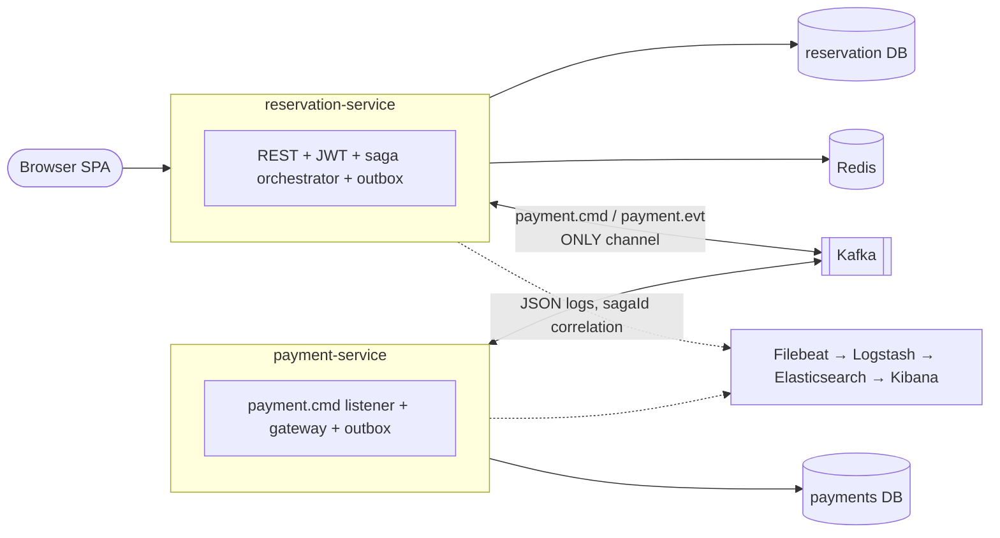
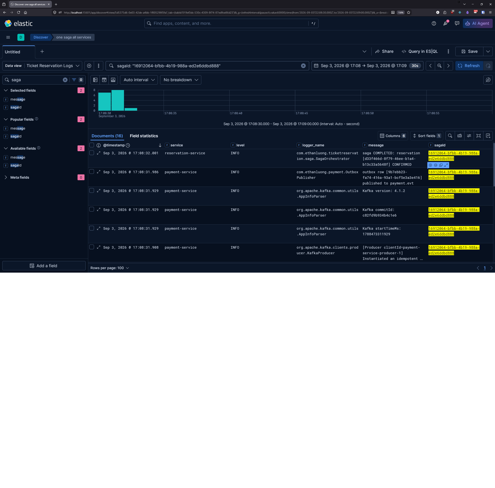
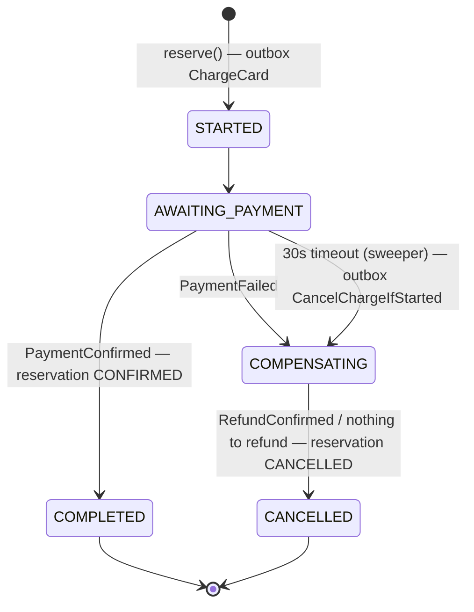

# Event Ticket Reservation System

Two Spring Boot services that sell seats without ever double-selling: **reservation-service** owns seats, holds and the booking saga; **payment-service** owns charges. They share Kafka topics and an event contract, nothing else. One `sagaId` traces a booking across both — in Kibana locally, in CloudWatch in prod. Built as an interview portfolio piece.

**Live demo (AWS):** [https://d1bsa4m1s90vp2.cloudfront.net](https://d1bsa4m1s90vp2.cloudfront.net) · **Repo:** [github.com/EthanLuong/ticket-reservation](https://github.com/EthanLuong/ticket-reservation)

## Status

- **R3 — centralized logging, merged 2026-09-03.** JSON logs at the source, `sagaId` correlation through MDC, Filebeat → Logstash → Elasticsearch → Kibana behind `docker compose --profile elk` ([ADR 0010](docs/adr/0010-elk-structured-logging.md)).
- **R2 — payment-service extracted, merged 2026-08-31.** Two deployables, two databases with credential isolation ([ADR 0009](docs/adr/0009-payment-db-one-container-two-databases.md)), two outboxes, wire format unchanged.
- **AWS:** live on ECS Fargate ×2 behind ALB + CloudFront; the two-container redeploy and the GitHub Actions matrix build are R4, in progress ([roadmap](#roadmap)).

---

## Architecture



Two services sharing nothing but Kafka topics and the event contract; each owns its database, dedup table and outbox; one `sagaId` traces a booking across both.



*One `sagaId : "…"` query in Kibana: reserve → charge → confirm across both services, in order. The declined-card path reads the same way — five lines, all `INFO`, because a declined charge is a business outcome, not a fault.*

### Service boundary — what is actually shared

- **Shared:** the Kafka topics `payment.cmd` / `payment.evt` and the event-contract records that ride on them. The contracts are **duplicated** into each service on purpose rather than published as a shared JAR — additive-only schema rules govern changes ([REFOCUS-DESIGN §2](docs/REFOCUS-DESIGN.md), Decision D1).
- **Not shared:** databases (`ticketreservation` vs `payments`, separate roles, `REVOKE CONNECT` verified), `processed_events` dedup tables, outbox tables and relays, Flyway histories, and code — neither module compiles against the other. Same Postgres container locally, RDS in prod; the isolation is ownership and credentials, not hardware ([ADR 0009](docs/adr/0009-payment-db-one-container-two-databases.md)).
- **Consequence:** no cross-service joins or transactions. The saga (below) is the only cross-service consistency mechanism, and that was true before the split — the seam existed as package discipline first, which is what made the extraction a move/copy/duplicate rather than a rewrite.

### Domain

```
Event  1───N  Seat  1───N  Reservation  N───1  User
                                status ∈ {HELD, CONFIRMED, EXPIRED, CANCELLED}
```

Full schema: [`reservation-service/src/main/resources/db/migration/V1__init.sql`](reservation-service/src/main/resources/db/migration/V1__init.sql).

### Reservation flow

```
reserve(userId, seatId)
  ├─ withSeatLock(seatId) — Redisson tryLock(100ms wait, 2s lease)
  │      └─ contention → SeatContentionException → 409 (retryable=true)
  │
  ├─ tryHold(seatId, reservationId, 10min) — SET NX EX hold:seat:{id}
  │      └─ collision → SeatNotAvailableException → 409
  │
  ├─ TransactionTemplate.execute:
  │      ├─ load seat from Postgres
  │      ├─ if seat.status == HELD → reconcile stale rows to EXPIRED, continue
  │      ├─ flip seat.status = HELD, save (saveAndFlush — @Version checked)
  │      └─ insert reservation row (id pre-assigned by service)
  │
  └─ on tx exception → holdStore.release(seatId)  (compensating DEL)
```

Cancellation mirrors the structure: lock → tx (set CANCELLED, free seat) → DEL Redis hold key after commit.

`myReservations()` lazily reconciles HELD-with-no-Redis-key rows to EXPIRED on read — replaces the retired `@Scheduled` sweeper.

### The booking saga

Reserving also starts a booking saga: the reservation transaction writes a `Saga` row and a `ChargeCard` command into the **transactional outbox** (same Postgres commit — no dual-write window); a relay publishes outbox rows to Kafka; payment-service charges and replies on `payment.evt`; the orchestrator drives the state machine to a terminal state.



Messages ride a generic envelope keyed by `sagaId` (per-saga total order — [ADR 0003](docs/adr/0003-event-typing.md)); delivery is **at-least-once + idempotent consumers** (dedup on `eventId`), never a claimed "exactly-once"; unprocessable records go to `<topic>.DLT` after 3 attempts ([ADR 0007](docs/adr/0007-saga-messaging-outbox-orchestration-dlt.md)).

**Idempotency is layered — three nets, different failure modes:** the REST `Idempotency-Key` (required on `POST /api/reservations`) dedups client retries and replays the original response; each Kafka consumer's `processed_events` table dedups redelivered messages; the Redis seat hold blocks a second hold on the same seat. Any one alone leaves a gap the others close.

---

## Quick start

Everything runs in Docker Compose. Copy `.env.example` to `.env` (or export the three secrets it lists) first.

```bash
docker compose up -d --build                 # core five: reservation-service, payment-service, Postgres, Redis, Kafka
docker compose exec -T db psql -U postgres -d ticketreservation < scripts/dev-seed.sql   # 2 events, 36 seats (idempotent)
bash scripts/e2e-smoke.sh                    # register → pick a seat → reserve → poll until CONFIRMED; prints PASS
```

With the logging stack:

```bash
docker compose --profile elk up -d --build   # adds Elasticsearch, Logstash, Kibana, Filebeat
open http://localhost:15601                   # Kibana → Discover → data view applogs-* → saved search "one saga, all services"
```

Plain `docker compose up` never starts the ELK trio; `docker compose down` stops everything; `down -v` also drops the Postgres and Elasticsearch volumes.

Health probes: `curl localhost:8080/actuator/health` (reservation-service); payment-service's actuator is network-internal, its healthcheck runs inside the container. If Redis is unreachable, reservation endpoints return `503` with a retryable `ProblemDetail`; reads keep working.

<details><summary>Maven dev loop (fastest inner loop, one service at a time)</summary>

Requires Docker Desktop running (Testcontainers-backed dev Postgres).

```bash
./reservation-service/mvnw spring-boot:test-run    # dev run, auto-provisions Testcontainers Postgres
./reservation-service/mvnw verify                  # reservation-service suite + package
./payment-service/mvnw verify                      # payment-service suite + package
```

The `test-run` goal auto-wires a disposable Postgres container via `@ServiceConnection`, so no manual DB setup is needed.

</details>

---

## Observability

Both services log one JSON object per line (`logstash-logback-encoder`), with `service` and every MDC entry as fields. `sagaId` is set-and-cleared at seven seams — the orchestrator, the timeout sweeper per saga, both outbox relays per row, and both Kafka listeners from the envelope — and `requestId` on HTTP threads via a servlet filter. MDC is a `ThreadLocal` on pooled threads, so every non-HTTP seam clears what it set; verified by running a second saga on the same threads and confirming the first saga's query didn't grow.

Locally, `--profile elk` runs Filebeat (Docker autodiscover on the two app images) → Logstash (unwraps the JSON, drops noise) → Elasticsearch (one index per service per day, `applogs-<service>-<date>`) → Kibana. In prod the same JSON lines go to CloudWatch Logs via the `awslogs` driver, and `filter sagaId = "…"` in Logs Insights is the same query — no cluster to run. The decisions, and the traps hit on the way (Elasticsearch 9's built-in `logs-*-*` data-stream template among them), are in [ADR 0010](docs/adr/0010-elk-structured-logging.md).

---

## API reference

All endpoints are JSON. Protected endpoints require `Authorization: Bearer <token>` obtained from `/api/auth/login`.

### Auth

| Method | Path | Auth | Purpose |
|---|---|---|---|
| `POST` | `/api/auth/register` | Public | Create account, returns JWT |
| `POST` | `/api/auth/login` | Public | Exchange credentials for JWT |

### Events (read-only, public)

| Method | Path | Purpose |
|---|---|---|
| `GET` | `/api/events?page=0&size=20` | Paged list of upcoming events |
| `GET` | `/api/events/{id}` | Single event by ID |

### Seats (read-only, public)

| Method | Path | Purpose |
|---|---|---|
| `GET` | `/api/seats?eventId={uuid}&status={AVAILABLE\|HELD\|SOLD}` | Seats for an event; `status` filter optional |

### Reservations (JWT required)

| Method | Path | Purpose |
|---|---|---|
| `POST` | `/api/reservations` | Hold a seat (body: `{"seatId":"<uuid>"}`). **Requires `Idempotency-Key` header** (client-minted UUID per checkout attempt, reused across retries of it); returns `201`. Duplicate in flight → `409` + `Retry-After`; completed duplicate → original response replayed verbatim; key reuse with different body → `422` |
| `DELETE` | `/api/reservations/{id}` | Cancel own reservation, release seat |
| `GET` | `/api/reservations/me` | List caller's reservations |

### Operational

| Method | Path | Purpose |
|---|---|---|
| `GET` | `/actuator/health` | Liveness probe |
| `GET` | `/actuator/info` | Build info |

### Example: full booking flow

```bash
BASE=http://localhost:8080          # or https://d1bsa4m1s90vp2.cloudfront.net

# 1. Register
TOKEN=$(curl -s -X POST $BASE/api/auth/register \
  -H "Content-Type: application/json" \
  -d '{"email":"demo@example.com","password":"password12345","displayName":"Demo"}' \
  | jq -r .accessToken)

# 2. Pick an event + seat
EVENT_ID=$(curl -s $BASE/api/events | jq -r '.content[0].id')
SEAT_ID=$(curl -s "$BASE/api/seats?eventId=$EVENT_ID&status=AVAILABLE" | jq -r '.[0].id')

# 3. Reserve (Idempotency-Key is required — mint one per checkout attempt,
#    reuse it when retrying the SAME attempt: the retry replays, never double-books)
curl -X POST $BASE/api/reservations \
  -H "Authorization: Bearer $TOKEN" \
  -H "Content-Type: application/json" \
  -H "Idempotency-Key: $(uuidgen)" \
  -d "{\"seatId\":\"$SEAT_ID\"}"
```

`scripts/e2e-smoke.sh` is this flow as a script, polling `/api/reservations/me` until the saga lands on `CONFIRMED`. The seeded VIP-1 seat ($150) is the built-in sad path: the mock gateway declines anything over $100, and the saga compensates to `CANCELLED`.

Error responses follow [RFC 7807](https://www.rfc-editor.org/rfc/rfc7807) (`application/problem+json`). Headline cases:

| Status | `type` slug | When | Client action |
|---|---|---|---|
| `409` | `seat-not-available` | Seat is currently held by another user | Pick another seat |
| `409` | `seat-contention` | Another reserve/cancel for this seat is in flight (Redisson lock contention) | **Auto-retry** — `retryable: true` flag set |
| `409` | `optimistic-lock` | DB-level `@Version` race lost (rare under the lock + TTL) | Refresh state, retry |
| `503` | `redis-unavailable` | Redis is unreachable — coordination layer is down | Retry after `retryAfterSeconds` (5s) |
| `409` | *(no problem body)* | Same `Idempotency-Key` still in flight — the bare body is the discriminator vs the typed 409s above | Retry after `Retry-After` (2s) with the **same** key |
| `422` | *(no problem body)* | `Idempotency-Key` reused with a different request body | Client bug — mint a fresh key |

Example for the double-book attempt:

```json
{
  "type": "https://ticket-reservation.example/errors/seat-not-available",
  "title": "Seat not available",
  "status": 409,
  "detail": "Seat 9c8f... is not available",
  "seatId": "9c8f..."
}
```

Example for Redis outage:

```json
{
  "type": "https://ticket-reservation.example/errors/redis-unavailable",
  "title": "Service temporarily unavailable",
  "status": 503,
  "detail": "Reservation service is temporarily unavailable. Please retry shortly.",
  "retryable": true,
  "retryAfterSeconds": 5
}
```

---

## Design decisions

Recorded as ADRs where the decision had real alternatives: [0002 Redis for holds and locks](docs/adr/0002-redis-for-holds-and-locks.md) · [0003 event typing](docs/adr/0003-event-typing.md) · [0005 self-managed Kafka, not MSK](docs/adr/0005-kafka-self-managed-not-msk.md) · [0007 outbox / orchestration / ordering / DLT](docs/adr/0007-saga-messaging-outbox-orchestration-dlt.md) · [0008 deliberately not transactional](docs/adr/0008-deliberately-not-transactional.md) · [0009 one Postgres container, two databases](docs/adr/0009-payment-db-one-container-two-databases.md) · [0010 structured logging + ELK behind a profile](docs/adr/0010-elk-structured-logging.md). The numbered items below are the reservation-side decisions that predate the ADR habit, plus the two split-era ones in short form.

### 1. Three-layer concurrency defense (not one)

Booking the same seat from multiple clients at the same instant must allow **exactly one** to win. I layered three independent defenses, each catching a different race class:

| Layer | Check | Race class caught |
|---|---|---|
| 1. App-layer fast-fail | `seat.status == AVAILABLE` at service entry | Naive sequential double-book |
| 2. JPA optimistic lock | `@Version` bump fails on concurrent commit | Two threads both passed the status check |
| 3. Partial unique index | `CREATE UNIQUE INDEX ... WHERE status IN ('HELD','CONFIRMED')` | Any race that bypasses Hibernate (bulk SQL, manual insert) |

Layer 1 is cheap and catches the normal case. Layer 2 is the primary correctness guarantee. Layer 3 is a DB-level backstop — interviewers specifically ask *"what if the app is bypassed?"*

**Non-obvious gotcha I hit:** Hibernate flushes INSERTs before UPDATEs by default. Without `saveAndFlush(seat)` before the reservation insert, the partial unique index would catch the race *before* `@Version` had a chance to fire — masking the optimistic-lock design. `saveAndFlush` inverts the flush order so `@Version` is the primary catcher, as intended.

### 2. Partial unique index over CHECK constraint

The "one active reservation per seat" rule could be a CHECK constraint or a unique index. I chose a **partial unique index on `seat_id WHERE status IN ('HELD','CONFIRMED')`** because:

- CHECK can't enforce cross-row uniqueness (it's a per-row predicate).
- Partial unique index preserves history: expired and cancelled rows stay in the table and don't compete.
- B-tree lookups for the active-reservation check use the index, so reads are also faster.

### 3. Java-side `@PreUpdate` for `updated_at` (not a DB trigger)

Two common ways to keep `updated_at` fresh on every update: DB trigger or JPA lifecycle callback. I chose `@PreUpdate`:

- Simpler deploy — no trigger install/rollback to manage.
- Works identically across Testcontainers-Postgres and production.
- **Known tradeoff:** doesn't fire on JPQL bulk `UPDATE` statements. Acceptable — no bulk updates in the code path. If bulk operations are added later (e.g., expiry sweep rewritten as one bulk UPDATE), this moves to a trigger.

### 4. JWT stateless auth, no server-side session

`/api/auth/login` returns a JWT signed with HS256. The auth filter validates signature + expiry on each request and populates `SecurityContext`. No session store.

- Works across horizontal scale without sticky sessions or a session DB.
- Secret sourced from `APP_SECURITY_JWT_SECRET` env var, ≥32 bytes for HS256 key-length requirement; a startup guard refuses default secrets outside dev.

### 5. `ddl-auto=validate` + Flyway owns schema

`spring.jpa.hibernate.ddl-auto=validate` means Hibernate does not mutate the schema — it only verifies that entities and tables match. Flyway migrations are the source of truth, one history per service.

- Catches entity/schema drift at startup — app fails to boot rather than silently emitting malformed SQL.
- Makes schema changes auditable (one migration file per change, version-controlled).
- Validated in CI: startup itself is the smoke test.

### 6. Redis for coordination, Postgres for system of record

Full rationale in [ADR 0002](docs/adr/0002-redis-for-holds-and-locks.md). Headline decisions:

- **Two-layer Redis**: `SET NX EX` for the TTL hold (atomic, 10 min business duration) and Redisson `RLock` for the critical-section lock (2 s lease, prevents wasted work on hot events). Both are needed — the SET NX gives correctness, the RLock gives efficiency.
- **Drop the `@Scheduled` sweeper**: Redis-native TTL replaces it. Stale rows are reconciled on-the-fly inside `reserve()` (under the RLock) and lazily inside `myReservations()` (on user read). Self-healing without a polling thread.
- **Per-seat lock granularity**: `lock:seat:{id}`, not per-event. Two reservations for two different seats in the same event don't serialize.
- **Fail-closed on Redis outage** (503 SERVICE_UNAVAILABLE): a fall-back-to-DB-only path would lose cross-JVM serialization and permit double-holds. Better to refuse service. Verified by `RedisOutageIT`.

### 7. `Persistable<UUID>` + drop `@GeneratedValue` for pre-assigned reservation ids

"Redis-first ordering" needs the reservation id **before** the DB insert (so the id can be the Redis value at `SET NX EX` time). Pre-assigning a UUID to a Hibernate entity with `@GeneratedValue(strategy = UUID)` triggered both Spring Data's "is this new?" heuristic AND Hibernate's transient-vs-detached classifier — two independent layers that needed to agree. The fix:

```java
@Id
@Column(columnDefinition = "uuid", updatable = false, nullable = false)
private UUID id;          // no @GeneratedValue

// + implements Persistable<UUID> with @Transient boolean isNew flag
```

Drops `@GeneratedValue` (so Hibernate doesn't classify pre-set ids as detached) and implements `Persistable` (so Spring Data routes to `persist()`, not `merge()`). Four rounds of failure (StaleObjectStateException → PersistentObjectException → still PersistentObjectException with Persistable alone → finally INSERT works once `@GeneratedValue` is dropped) before the right combination clicked — interview-grade JPA gotcha story.

### 8. Database-per-service as ownership, not hardware ([ADR 0009](docs/adr/0009-payment-db-one-container-two-databases.md))

One Postgres container, two databases, two roles, `REVOKE CONNECT` on the other's database. Cross-service SQL fails at connection time, not as a grant accident; a second container would have added weight without adding logical isolation, and prod is RDS either way.

### 9. Structured logs at the source; ELK local, CloudWatch prod ([ADR 0010](docs/adr/0010-elk-structured-logging.md))

Correlation is free when the app writes JSON with MDC fields and expensive everywhere else. Logstash earns its slot with the two-layer JSON unwrap, a `service` fallback for non-JSON startup lines, and a drop stage. Classic daily indices under an `applogs-` prefix — not `logs-`, which Elasticsearch 9's built-in template silently turns into data streams that reject Logstash's writes.

---

## Testing

### Concurrency invariant — the headline test

[`SeatReservationConcurrencyIT`](reservation-service/src/test/java/com/ethanluong/ticketreservation/SeatReservationConcurrencyIT.java) races 10 threads at the same seat through a `CountDownLatch` start-gate, then asserts:

- Exactly one `Outcome.SUCCESS`
- Zero `Outcome.FAILURE_OTHER` (unexpected errors)
- Single reservation row in DB
- Seat final state: `HELD`, `version == 1`

Categorized outcomes distinguish app-layer losses (`FAILURE_NOT_AVAILABLE`) from DB-layer losses (`FAILURE_OPTIMISTIC_LOCK`, `FAILURE_DATA_INTEGRITY`), proving which layer caught each racing thread. Ran 50× clean — invariant is stable, not flaky.

### Redis tests

| Test class | What it verifies |
|---|---|
| [`RedisTTLHoldIT`](reservation-service/src/test/java/com/ethanluong/ticketreservation/RedisTTLHoldIT.java) | `reserve()` writes `hold:seat:{id}` with TTL ≈ 600s; collision blocks second reserve; `cancel()` releases the key; on-the-fly + lazy reconciliation paths |
| [`RedissonLockContentionIT`](reservation-service/src/test/java/com/ethanluong/ticketreservation/RedissonLockContentionIT.java) | `reserve()` fast-fails with `SeatContentionException` (<500ms) when the `RLock` is held on a different thread; succeeds normally once released |
| [`RedisOutageIT`](reservation-service/src/test/java/com/ethanluong/ticketreservation/RedisOutageIT.java) | `@MockitoBean RedissonClient` injects connection failure; asserts exception bubbles to handler, zero DB drift, 503 ProblemDetail mapping |

### Saga and cross-service tests

Kafka-backed suites in both modules run against live Testcontainers brokers with Awaitility: crash-replay republishing from the outbox, duplicate-event dedup, out-of-order rejection, DLT routing after 3 attempts, and — since the split — `PaymentEvtConsumptionIT` on the reservation side and `PaymentRoundTripIT` on the payment side, proving each service's wire guarantees independently. `scripts/e2e-smoke.sh` is the cross-service proof on the real compose stack.

### Stack

- JUnit 5 + AssertJ
- Testcontainers with `@ServiceConnection` for Postgres 17-alpine, Redis 7-alpine and Kafka
- `@MockitoBean` (Spring Framework 6.2+) for failure injection
- No H2, no mocks for DB-backed behavior — Testcontainers because H2's partial index and `gen_random_uuid()` don't match Postgres semantics

Run both suites:

```bash
./reservation-service/mvnw verify
./payment-service/mvnw verify
```

---

## Tech stack

- **Runtime:** Java 21, Spring Boot 4.0.x — two modules, two Dockerfiles, independent `mvnw`
- **Messaging:** Apache Kafka (KRaft), Spring Kafka; transactional outbox in each service
- **Data:** PostgreSQL 17-alpine, Flyway migrations per service, Spring Data JPA (Hibernate)
- **Coordination:** Redis 7-alpine, Spring Data Redis (Lettuce) for TTL holds, Redisson 3.50.0 for distributed locks
- **Security:** Spring Security 6, jjwt 0.12.x
- **Logging:** logstash-logback-encoder (JSON + MDC); Elastic 9.5 stack locally behind a compose profile; CloudWatch Logs in prod
- **Testing:** JUnit 5, AssertJ, Testcontainers, Awaitility, `@MockitoBean` for failure injection
- **Packaging:** Multi-stage Dockerfiles (Java 21 JDK builder → JRE-alpine runtime)
- **Deploy:** AWS — ECS Fargate behind ALB, RDS Postgres, ElastiCache Redis, self-managed Kafka (KRaft) on EC2, CloudFront two-origin (see `docs/aws/DEPLOY-HANDBOOK.md`)
- **Build:** Maven (via `mvnw`)

---

## Roadmap

| Phase | Scope | Status |
|---|---|---|
| **0. Reservation foundation** | Entities, JWT auth, `@Version` optimistic lock, partial-index backstop, Testcontainers race proof | ✅ Shipped |
| **1. Redis holds + distributed lock** | Redis-native TTL holds, Redisson `RLock` per seat, lazy reconciliation, fail-closed (503) on Redis outage | ✅ Shipped |
| **2a. Payment saga over Kafka** | Transactional outbox → topics → idempotent consumers → DLT; orchestrated state machine + timeout compensation; REST `Idempotency-Key` | ✅ Shipped (merged 2026-08-21) |
| **Frontend** | React 19 SPA: auth, events, seat grid with live hold countdown + saga status | ✅ Shipped |
| **AWS deploy** | VPC, ECS Fargate ×2, RDS, ElastiCache, KRaft on EC2, SSM secrets, CloudFront | ✅ Live |
| **R1. Own the container stack** | Multi-stage Dockerfile, healthcheck-gated compose, secrets in `.env`, module layout — [refocus design](docs/REFOCUS-DESIGN.md) | ✅ Merged `841a997` |
| **R2. Microservice split** | `payment-service` extracted: own DB, own outbox, duplicated contracts, `e2e-smoke.sh` | ✅ Merged `899d626` (2026-08-31) |
| **R3. ELK logging** | JSON logs + `sagaId` correlation → Filebeat → Logstash → Elasticsearch → Kibana, `--profile elk` | ✅ Merged `6d249a3` (2026-09-03) |
| **R4. Surface** | Two-container task definition, GitHub Actions matrix build over OIDC to two ECR repos, CloudWatch saga trace | ▶ Active |
| **Parked** | Rate limiting, circuit breaker, caching, tickets/QR, refunds, group bookings, load tests | Backlog |

Each phase ships polished — deployed, tested, documented. At any checkpoint there is an interview-ready artifact.

---

## Env vars

Required at runtime (compose supplies all of them from `.env`):

| Variable | Service | Purpose |
|---|---|---|
| `SPRING_DATASOURCE_URL` | both | JDBC URL — `…/ticketreservation` for reservation-service, `…/payments` for payment-service |
| `SPRING_DATASOURCE_USERNAME` / `SPRING_DATASOURCE_PASSWORD` | reservation | Reservation DB role |
| `PAYMENT_DB_PASSWORD` | payment | `payment_user`'s password (the role is created by `scripts/initdb/01-payments.sh` on first Postgres init) |
| `SPRING_DATA_REDIS_URL` | reservation | `redis://host:port` for plaintext, `rediss://` for TLS (prod ElastiCache with transit encryption) |
| `SPRING_KAFKA_BOOTSTRAP_SERVERS` | both | `broker:29092` in compose, the EC2 broker in prod |
| `APP_SECURITY_JWT_SECRET` | reservation | HS256 signing key, ≥32 bytes |

A dev JWT secret is baked into `application.properties` — **never use it in production**; the startup guard enforces that outside the `dev` profile.

## Frontend

A React 19 + TypeScript + Tailwind v4 SPA lives in `frontend/` — login/register, an events list, seat selection with a live hold countdown, and an account page for managing reservations. It talks to the backend over the REST API documented above.

### Running it locally

1. **Backend stack** (Docker Compose): `docker compose up -d`. If you change backend code (e.g. `SecurityConfig` CORS), rebuild with `docker compose up -d --build app`.

2. **Seed data** — there is no event-creation endpoint (`EventController` is read-only), so a fresh database has nothing to browse. Load the dev seed (2 events, 36 seats total) with:

   ```bash
   docker compose exec -T db psql -U postgres -d ticketreservation < scripts/dev-seed.sql
   ```

   Safe to re-run — every row uses a fixed UUID + `ON CONFLICT (id) DO NOTHING`.

3. **Frontend dev server:**

   ```bash
   cd frontend
   npm install
   npm run dev
   ```

   Opens on `http://localhost:5173`. The backend's CORS config already allows this origin for `/api/**` (see `SecurityConfig.corsConfigurationSource()`) — no extra setup needed as long as the backend is reachable at `http://localhost:8080` (the default in `frontend/.env.development`).

### Two-browser demo script

Shows off the concurrency guarantees from a real browser, not just curl:

1. Open the app in two browsers (or one normal + one incognito window) — call them **A** and **B**. Register/log in as two different users, then navigate both to the **same event**.
2. In **A**, click an available seat.
   - A gets a **hold banner** at the top of the page with a live countdown (10 minutes), and the seat flips to "held" in the grid.
3. In **B**, click the **same seat** (before A's hold expires).
   - B gets a **contention/unavailable toast** (`"Someone beat you to that seat — pick another."` or `"That seat was just taken."` depending on timing), and B's seat grid updates to show the seat as **HELD** within one poll cycle (~5s).
4. In **A**, go to **My Reservations** (`/account`) and cancel the held reservation.
   - The seat frees up; B's grid reflects `AVAILABLE` again within one poll cycle.
5. Optional — the 3-day cancellation cutoff: cancelling a `CONFIRMED` reservation for an event starting within 3 days returns the `cancellation-window-closed` error, surfaced as the toast `"Too close to the event to cancel (3-day cutoff)."` The seeded events are 30/45 days out, so this path needs either a manually-adjusted `starts_at` or a purpose-built near-term event to trigger.


---

<details><summary>History — how it got here (Phase 0 → 2a, before the split)</summary>

**Phase 2a (payment saga over Kafka) — merged 2026-08-21.** Orchestrated booking saga (reserve → charge → confirm/compensate) via transactional outbox, idempotent consumers, DLT poison-pill handling, and an `Idempotency-Key` contract on the reserve endpoint, all inside one deployable with the payment component already event-only behind Kafka — the package discipline that later made R2 a move rather than a rewrite. Design records: [ADR 0003](docs/adr/0003-event-typing.md), [ADR 0007](docs/adr/0007-saga-messaging-outbox-orchestration-dlt.md), [ADR 0008](docs/adr/0008-deliberately-not-transactional.md).

**Phase 1 (Redis holds + distributed lock).** Reservation TTL became Redis-native (atomic `SET NX EX`), critical sections wrapped in a Redisson `RLock` for cross-JVM serialization, and the `@Scheduled` Postgres sweeper retired in favor of two-path lazy reconciliation. Failure-closed (503) on Redis outage — [ADR 0002](docs/adr/0002-redis-for-holds-and-locks.md).

**Phase 0 (reservation foundation).** Single-service reservation system with JWT auth, optimistic-locked seat holds, and Testcontainers-proven race invariants. First deployed on Railway with managed Postgres; moved to the AWS footprint above in July 2026.

</details>
