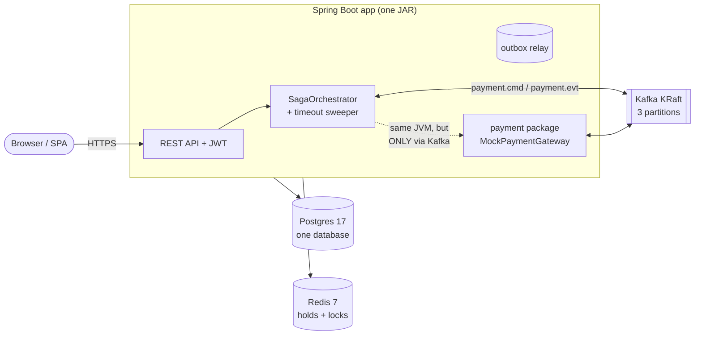
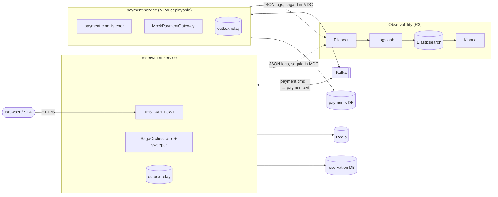
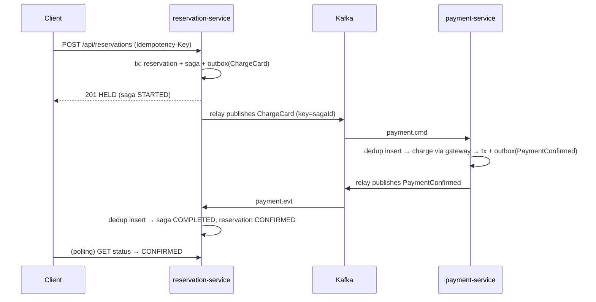
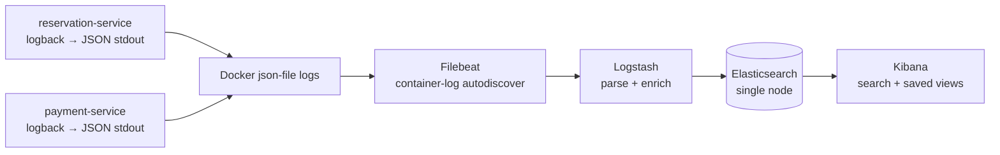

# Refocus Design — Microservices + DevOps (R-phases)

**Status:** Accepted 2026-08-23 (portfolio refocus — see `vault/personal/career/portfolio-refocus-2026-08.md`)
**Supersedes:** the Phase-2b "default: skip" gate in [PHASES-2-5-DESIGN.md](PHASES-2-5-DESIGN.md) §2.1 and ADR 0007's "revisit if participants grow" — the split is now IN, as the centerpiece.
**Siblings:** [ADR 0007](adr/0007-saga-messaging-outbox-orchestration-dlt.md) (messaging contracts — unchanged by this design) · [ADR 0008](adr/0008-deliberately-not-transactional.md) · `docs/aws/DEPLOY-HANDBOOK.md` (M4 stack the result must redeploy onto)

## 0. Why (one paragraph)

Screen-stage rejections + a stated job-market keyword set (microservices, containerization, centralized logging) the project almost-but-not-quite demonstrates. Phase 2a built the hard part — the saga already crosses a Kafka boundary between two components that share nothing but events (§2.1's package-discipline bet). This design cashes that bet: split the payment component into a real deployable, run the whole system as containers, and make one reservation traceable across services in Kibana. Everything here is interview-narratable: *"decomposed a deployed monolith along an event boundary I designed for it."*

## 1. Architecture — current vs target

### 1.1 Current (post-Phase-2a, one deployable)

The payment package already: has its own `processed_events` consumer identity (`payment-service` group), writes through the shared outbox, and never calls reservation code directly. The split moves code and a database — **no messaging contract changes**.

### 1.2 Target (end of R3)

Hard rules the target keeps:
- Services share **nothing** but Kafka topics and the envelope contract (ADR 0003/0007). No shared DB, no shared JPA entities, no REST between services.
- Each service owns its schema (own Flyway), its dedup table, and its outbox — the pattern is symmetric by design and already implemented that way.
- Redis stays reservation-only (holds/locks are a reservation concern).

## 2. R1 — Own + extend the container stack

**Reality check (2026-08-23):** `Dockerfile` (multi-stage Java 21) and `docker-compose.yml` (app + Postgres + Redis + Kafka KRaft, healthcheck-gated `depends_on`) already exist — built 🤖 in Phase 0/2a. R1 is therefore NOT "write a compose file"; it is:

1. **Explain-back ownership** of the existing files (they're now interview material): multi-stage build layers, the dual-listener Kafka config (`broker:29092` vs `localhost:9092` — the classic advertised-listeners trap), healthcheck gating, named volume vs bind mount.
2. **Hardening pass** (🎓 small, real edits): move secrets to a `.env` file · add `restart: unless-stopped` where it makes sense · confirm `docker compose down` vs `down -v` semantics against `pgdata`.
3. **Multi-service prep** — the one structural decision R2 depends on:

**Decision D1 — repo layout for two services.** Options:
- (a) **Two sibling Maven projects in one repo** — `reservation-service/` + `payment-service/`, each fully independent (own pom, own Dockerfile), compose at the root. *Recommended:* matches "separate deployables" honestly, no parent-pom coupling to explain away, and each service's Docker build context stays small.
- (b) Maven multi-module with a shared `contracts` module for the event records. Cleaner DRY, but a shared artifact is exactly the coupling microservices talk avoids — and the envelope is 5 small records. **Duplicate the contract records instead** (both services own their copy; schema rules in §2.2 of the old design keep them compatible). That duplication *is* the interview answer about contract governance.
- (c) Two repos. Overkill for a portfolio; harder to demo.

Consequence of (a): the existing root `src/` moves to `reservation-service/`. Git preserves history through the move (`git log --follow`); do it as its own commit, nothing else in it.

## 3. R2 — Extract payment-service

### 3.1 What moves

| Concern | Goes to | Notes |
|---|---|---|
| `payment/` package (listener, gateway, Payment entity/repo) | payment-service | near-verbatim move |
| `payments` table + its Flyway history | payment-service's own DB | fresh V1 there; drop from reservation's next migration |
| `processed_events` rows for group `payment-service` | payment-service DB (fresh table) | dedup is per-service by design |
| outbox drain for `aggregate_type='Payment'` | payment-service's own outbox table + relay | the relay class is copy-paste symmetric |
| event records (`ChargeCard`, `PaymentConfirmed`, …) | BOTH (duplicated by D1) | wire format unchanged |

### 3.2 Databases

One Postgres **container**, two **databases** (`ticketreservation`, `payments`), separate credentials per service, created by an init script mounted at `/docker-entrypoint-initdb.d/`. Honest-enough isolation for a portfolio (services cannot see each other's data; the "two RDS instances in real prod" line is the ADR consequence note) without doubling container weight. **ADR 0009** records this.

### 3.3 The saga after the split

Unchanged — that's the point, and the demo line. Sequence for the happy path:

Failure paths (declined card, 30s timeout + `CancelChargeIfStarted`, poison pill → `.DLT`) survive verbatim from ADR 0007.

### 3.4 Testing strategy

- Each service keeps its own Testcontainers IT suite (its DB + Kafka).
- The cross-service E2E (`SagaE2EIT` heir): **compose-based smoke** — `docker compose up`, run the API journey against localhost, assert terminal states. Script it (`scripts/e2e-smoke.sh`) so it's CI-runnable; a JUnit wrapper is optional polish, not the point.
- The senior-signal ITs (dedup replay, crash-republish, wrong-state skip) stay in reservation-service against its own containers — they test *its* guarantees, not the wire.

### 3.5 Config/naming

`spring.application.name` = service name (this becomes the ELK `service` field in R3). Ports: reservation 8080, payment 8081 (payment needs no public port in compose — actuator only). Consumer groups already distinct.

## 4. R3 — ELK centralized logging

### 4.1 Pipeline

- **App side:** `logstash-logback-encoder` — logs become JSON with `service`, `level`, `logger`, message, and **MDC fields**. Zero log-statement rewrites; the encoder does it.
- **Correlation:** `sagaId` into MDC in the orchestrator, listeners, sweeper, and relay (set-and-clear around each unit of work — listeners and `@Scheduled` methods, not a servlet filter, are the seams that matter here); `requestId` per HTTP request via one servlet filter. Kafka carries sagaId already (it's the message key + envelope field) — consumers restore it to MDC on receive.
- **Why Logstash at all** (vs Filebeat→ES direct): it's the literal E-L-K resume claim, and it earns its place doing parse/enrich (drop noisy health-check logs, normalize levels). Resource note: ES+Kibana+Logstash ≈ 2–3 GB RAM — fine on the dev box, and compose gets a `--profile elk` so the core stack still runs without it.
- **Demo artifact (definition of done):** Kibana saved search "one saga, all services" — filter `sagaId:<x>`, see reserve → publish → charge → confirm interleaved across both services. Screenshot into the README.

**ADR 0010** records: structured-JSON-at-source (vs parsing text), Filebeat+Logstash split, single-node ES with security off for local (and what prod would change: managed OpenSearch/Elastic Cloud, ILM retention).

### 4.2 Out of scope (deliberately)

Metrics/Grafana/Prometheus, tracing (OpenTelemetry/Zipkin), Kafka UI consoles. Each is a fine later phase; none is needed for the ELK claim. Do not scope-creep here — R4 is the phase that pays.

## 5. R4 — Surface it (the phase that fixes screens)

- README: target diagram (§1.2) replaces "planned" wording; compose quickstart for the full stack incl. `--profile elk`; Kibana screenshot.
- **AWS redeploy of the new shape** — scope call: both services as **two containers in the ONE existing Fargate task-def** first (cheapest, zero new infra, still "two services, two images" — the ADR notes separate task-defs/services as the real-prod shape). ELK does NOT deploy to AWS (cost); CloudWatch remains the prod logging answer — that contrast is itself an interview line.
- Resume v5 + LinkedIn + pinned repo with the new keyword set.

## 6. Open decisions (settle in-phase, each is one short conversation)

| # | Decision | Phase | Default |
|---|---|---|---|
| D1 | Repo layout | R1 | (a) sibling projects, duplicated contracts |
| D2 | Payment DB: same container/two DBs vs second container | R2 | same container, two DBs (ADR 0009) |
| D3 | Filebeat→ES direct vs +Logstash | R3 | +Logstash (ADR 0010) |
| D4 | AWS shape for two services | R4 | one task-def, two containers |
