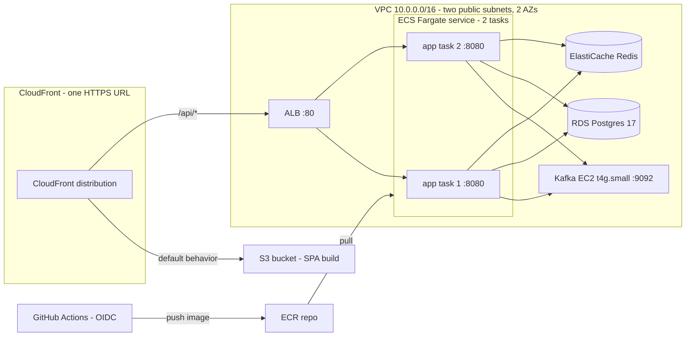

# AWS Deploy Handbook — ticket-reservation (M4)

Prepared 2026-07-28. Companion files: [decisions.md](decisions.md) (read first) ·
`artifacts/` (task definition, Kafka user-data, CI workflows, teardown script).
Vault orientation doc: `vault/learning/ticket-reservation-aws-overview.md`.

**How to use this:** phases in order, each has **Do → Verify → Concept**. Check boxes as you go.
Console-first on purpose — seeing each service is the point. Verify commands assume the AWS CLI
is configured (Phase 0). When something differs from what's written here (console UIs drift),
the *Concept* line tells you what actually matters so you can adapt.

**Prereq state:** M1 will ideally be merged first (roadmap: deploy after Kafka lands).
The handbook doesn't technically depend on it — but deploy `main` after the merge, not the branch.

## Target architecture

Why this shape (the interview sentence): *managed services where state lives (RDS, ElastiCache),
self-managed where managed is cost-prohibitive (Kafka — MSK ADR), Fargate ×2 to prove the
multi-instance story, CloudFront two-origin so frontend and API share one HTTPS URL with zero CORS.*

## Security group matrix (create in Phase 3, reference throughout)

| SG | Inbound | From | Purpose |
|---|---|---|---|
| `alb-sg` | TCP 80 | CloudFront **managed prefix list** (`com.amazonaws.global.cloudfront.origin-facing`) | Only CloudFront reaches the ALB |
| `app-sg` | TCP 8080 | `alb-sg` | Only the ALB reaches app tasks |
| `kafka-sg` | TCP 9092 | `app-sg` · TCP 22 from *your home IP only* (or none — prefer SSM Session Manager) | Broker + emergency shell |
| `db-sg` | TCP 5432 | `app-sg` (+ temporarily your home IP during Phase 5 seeding, then remove) | Postgres |
| `redis-sg` | TCP 6379 | `app-sg` | Redis |

Egress: leave default allow-all everywhere. The chain `CloudFront → alb-sg → app-sg → {kafka,db,redis}-sg`
means being "in a public subnet" exposes nothing that isn't explicitly opened.

## App environment variables (Phase 6 task definition — draft in `artifacts/task-def-app.json`)

| Variable | Value | Source |
|---|---|---|
| `SPRING_PROFILES_ACTIVE` | `prod` | plain env |
| `SPRING_DATASOURCE_URL` | `jdbc:postgresql://<rds-endpoint>:5432/ticketreservation` | plain env |
| `SPRING_DATASOURCE_USERNAME` | `postgres` | plain env |
| `SPRING_DATASOURCE_PASSWORD` | Parameter Store `/ticketres/prod/db-password` | **secret** |
| `SPRING_DATA_REDIS_URL` | `redis://<elasticache-endpoint>:6379` | plain env |
| `SPRING_KAFKA_BOOTSTRAP_SERVERS` | `<kafka-ec2-private-ip>:9092` | plain env |
| `APP_SECURITY_JWT_SECRET` | Parameter Store `/ticketres/prod/jwt-secret` | **secret** |
| `JAVA_TOOL_OPTIONS` | `-XX:MaxRAMPercentage=75` | plain env — JVM must respect the 1 GB task limit |

---

## Phase 0 — Account + guardrails (~45 min) — NON-NEGOTIABLE FIRST

- [ ] Create the AWS account (needs email — see decisions Q2 — and card). Choose region **us-east-2** in the console immediately and stay there; resources are region-scoped and "where did my cluster go" is always a region mixup.
- [ ] Root account: enable **MFA**, then stop using root.
- [ ] IAM → create user `ethan-admin`, attach `AdministratorAccess`, enable console MFA. Create an **access key** (CLI use case) — this is the only copy-it-now secret; store it in your password manager.
- [ ] Install AWS CLI v2 on Windows → `aws configure` (key, secret, `us-east-2`, `json`).
- [ ] **Billing → Budgets**: create a monthly cost budget, $20, alerts at 50/80/100% to your email. Add a second budget at $40 as the "something is wrong" tripwire.
- [ ] Skim `artifacts/teardown.sh` now so you know what "zero the account" means before anything exists.

**Verify:** `aws sts get-caller-identity` returns the `ethan-admin` ARN.
**Concept:** root = break-glass only. Everything you ever do is as an IAM principal, and later your *services* get their own principals (task roles) — same idea, no humans involved.

## Phase 1 — Ratify decisions + ADRs (~30 min, with Claude)

- [ ] Read `decisions.md` end-to-end. Override anything — nothing is poured in concrete until Phase 3.
- [ ] Settle Q3 (Kafka on EC2 vs Fargate+EFS) and Q4 (teardown cadence).
- [ ] Write two ADRs into `docs/adr/` (Claude drafts, you ratify): **MSK vs self-managed Kafka** (the cost ADR — get real numbers from the MSK pricing page, that's the interview answer) and **public-subnet + SG-chain vs private-subnet + NAT** (the network ADR).

**Concept:** in an interview, "I chose X" is worth little; "I chose X over Y because Z, and in prod I'd revisit when W" is the whole game. These two ADRs are that sentence, written down.

## Phase 2 — ECR + first manual image push (~30 min)

- [ ] ECR → create private repo `ticket-reservation`.
- [ ] Locally: `docker build -t ticket-reservation .` (the existing multi-stage Dockerfile — no changes needed).
- [ ] Follow the repo's "View push commands" (login → tag → push). Push as `:manual-1`.

**Verify:** image listed in ECR with a size around 200–300 MB.
**Concept:** ECR is just a Docker registry with IAM instead of passwords. The pipeline (Phase 9) automates exactly what you did by hand here — do it by hand once so the pipeline is never magic.

## Phase 3 — VPC + security groups (~45 min)

- [ ] VPC wizard: "VPC and more" — CIDR `10.0.0.0/16`, **2 AZs, 2 public subnets, 0 private subnets, no NAT**. Let it create the internet gateway + route tables.
- [ ] Create the five security groups from the matrix above. For `alb-sg`'s source, search prefix lists for `cloudfront-origin-facing` — using the **managed prefix list** (not 0.0.0.0/0) is the detail that makes public-subnet defensible.

**Verify:** VPC dashboard shows 2 subnets in different AZs, both with routes to the IGW; 5 SGs exist referencing each other (SG-as-source, not CIDRs, everywhere except your home IP).
**Concept:** SG references chain identity, not addresses — `app-sg` accepting from `alb-sg` keeps working when the ALB's IPs change. That's the pattern NACLs and IP rules can't give you.

## Phase 4 — Stateful layer: RDS, ElastiCache, Kafka EC2 (~1 h, mostly waiting)

- [ ] **RDS**: Postgres 17, `db.t4g.micro`, single-AZ, 20 GB gp3, db name `ticketreservation`, user `postgres`, generate a password → store it in Parameter Store NOW (Phase 5) so it never lives in a text file. VPC from Phase 3, `db-sg`, publicly accessible **No** (flips to Yes briefly in Phase 5).
- [ ] **ElastiCache**: Valkey if offered, else Redis OSS; `cache.t4g.micro`, 1 node, `redis-sg`. Disable automatic backups (stateless cache — holds are 10-min TTL anyway).
- [ ] **Kafka EC2** (provisional P1 — ratified in Phase 1): launch `t4g.small`, Amazon Linux 2023 **arm64**, 20 GB gp3, `kafka-sg`, public subnet, **user-data from `artifacts/kafka-ec2-user-data.sh`** (it installs docker and runs the same `apache/kafka:4.0.0` broker as docker-compose, with advertised listeners rewritten to the instance's private IP). No key pair — use SSM Session Manager if you ever need a shell (attach the `AmazonSSMManagedInstanceCore` role the console offers).

**Verify:** RDS + ElastiCache reach *Available*; for Kafka, EC2 → instance → note the **private IP**, then check user-data ran: Session Manager shell → `sudo docker ps` shows the broker.
**Concept:** the broker's `ADVERTISED_LISTENERS` is the classic Kafka-in-anything gotcha: clients bootstrap to any address, but then reconnect to whatever the broker *advertises*. It must advertise its private IP (stable within the VPC), not localhost, not the public IP. Same dual-listener issue you already solved in docker-compose.

## Phase 5 — Secrets + seed (~45 min) — 🎓 this one's yours start-to-finish

- [ ] SSM Parameter Store → create SecureString `/ticketres/prod/db-password` (the RDS password) and `/ticketres/prod/jwt-secret` (fresh 64-char random — NOT the dev default; your JwtSecretGuard will veto it anyway. `openssl rand -hex 32`).
- [ ] Seed: temporarily set RDS publicly accessible = Yes + add your home IP to `db-sg` on 5432 → run `scripts/dev-seed.sql` from Windows (`psql` or DBeaver) → **flip public access back off and remove the IP rule**. Keep VIP-1 — the $150 decline demo works in prod.
- [ ] Note: Flyway creates the schema on first app boot (Phase 6), so **seed AFTER the first task goes healthy**, or run migrations manually first. Recommended order: finish Phase 6, see the app healthy, then seed.

**Verify:** `aws ssm get-parameter --name /ticketres/prod/jwt-secret --with-decryption` returns it (that works because *you* are admin; the task role in Phase 6 gets a scoped version of the same permission).
**Concept:** the whole secret story is IAM: a SecureString is just a KMS-encrypted value; what makes it safe is *who* can decrypt. The ECS task role gets `ssm:GetParameters` on `/ticketres/prod/*` and nothing else — that's least privilege in one line.

## Phase 6 — ECS: cluster, task definition, service, ALB (~1.5 h) — the core phase

- [ ] ECS → create cluster `ticket-reservation` (Fargate).
- [ ] IAM: two roles. **Task execution role** (console default `ecsTaskExecutionRole` + inline policy allowing `ssm:GetParameters` on `arn:aws:ssm:us-east-2:*:parameter/ticketres/prod/*`) — this is who pulls the image and injects secrets. **Task role** — who the *running app* is; empty for now (the app calls no AWS APIs).
- [ ] Register the task definition from `artifacts/task-def-app.json` — fill in the account id, image URI, RDS/Redis endpoints, Kafka private IP. Note how the two Parameter Store entries ride under `secrets`, not `environment`.
- [ ] **ALB first**: create `ticket-alb` (internet-facing, both subnets, `alb-sg`), target group `ticket-app-tg` (type **IP**, port 8080, health check path `/actuator/health`, healthy threshold 2).
- [ ] ECS service: launch type Fargate, task def above, **desired count 2**, both subnets, `app-sg`, public IP **ENABLED** (that's the no-NAT tradeoff — it's how tasks pull from ECR), attach to `ticket-app-tg`.
- [ ] Watch the deployment: ECS service events + target group health. First boot runs Flyway against the empty RDS.
- [ ] Now do Phase 5's seed step, then re-check.

**Verify:** 2/2 tasks healthy in the target group. `curl http://<alb-dns>/actuator/health` → `{"status":"UP"}` (works from your machine only if you temporarily add your IP to `alb-sg` — or skip and trust the target group; the real test comes with CloudFront).
**Concept:** the task definition is the contract ("what to run, with what resources, secrets, logs"); the service is the promise ("keep N of these alive behind this target group"). Fargate is what removes the EC2 fleet you'd otherwise manage between them. Two tasks + one URL = the M3 multi-instance proof, live: Redisson locks and the partial unique index are now doing real cross-instance work.

## Phase 7 — Frontend: S3 + CloudFront (~45 min)

- [ ] S3: bucket `ticket-reservation-web-<something-unique>`, all public access **blocked** (CloudFront OAC will be the only reader).
- [ ] `cd frontend && npm run build` (no `VITE_API_BASE` needed — same-origin default is exactly right) → upload `dist/` to the bucket (`aws s3 sync dist/ s3://<bucket>`).
- [ ] CloudFront distribution:
  - Origin 1: the S3 bucket with **Origin Access Control** (console offers to write the bucket policy — accept).
  - Origin 2: the ALB (HTTP only to origin).
  - Default behavior → S3. **Additional behavior `/api/*` → ALB origin**, cache policy **CachingDisabled**, origin request policy **AllViewerExceptHostHeader** (forwards Authorization + all headers/query strings — the JWT must reach Spring).
  - Error pages: 403 and 404 → `/index.html`, response code 200 (SPA fallback for BrowserRouter).
- [ ] Optional hardening (do later if bored): custom `X-Origin-Secret` header CloudFront→ALB + ALB listener rule requiring it.

**Verify:** the `https://<dist-id>.cloudfront.net` URL loads the app; register, log in, reserve a $50 seat → CONFIRMED in ~2 s; reserve VIP-1 → declined → CANCELLED. **That's the whole system, live on AWS.** Screenshot it.
**Concept:** the two-origin pattern is why there's no CORS config anywhere: browser sees one origin, CloudFront routes by path behind the curtain. `AllViewerExceptHostHeader` exists because forwarding the viewer's `Host` header would confuse the ALB — everything else (including `Authorization`) passes through.

## Phase 8 — Observability floor (~45 min)

- [ ] The task definition already ships `awslogs` → log group `/ecs/ticket-reservation`. Open it, watch a saga complete in the logs from two different task streams.
- [ ] CloudWatch dashboard `ticket-reservation`: ALB requests + 5xx, target response time, ECS CPU/memory, RDS connections + free storage.
- [ ] Alarms: ALB 5xx > 10 in 5 min · RDS free storage < 2 GB · (budget alarms exist from Phase 0).

**Concept:** two tasks logging to one group with separate streams is your first real "grep across instances" experience — the thing that later justifies structured JSON logs + correlation ids (M3 item, still open).

## Phase 9 — CI/CD: GitHub OIDC + Actions (~1.5 h)

- [ ] IAM → Identity provider: `token.actions.githubusercontent.com` (console has a wizard).
- [ ] Role `github-deploy` trusted by that provider, condition `sub = repo:EthanLuong/ticket-reservation:ref:refs/heads/main`; permissions: ECR push, `ecs:UpdateService`/`RegisterTaskDefinition` (+ `iam:PassRole` on the two task roles), S3 sync on the web bucket, `cloudfront:CreateInvalidation`.
- [ ] Copy `artifacts/deploy-backend.yml` and `artifacts/deploy-frontend.yml` into `.github/workflows/`, fill the 4 placeholder values (role ARN, ECR repo, cluster/service, bucket + distribution id), commit to main.
- [ ] Watch the run: test → build → push → `aws ecs update-service --force-new-deployment` → rolling replacement behind the ALB, zero downtime.

**Verify:** push a trivial README change → green pipeline → new task revision live.
**Concept:** OIDC = GitHub proves "I am a workflow on main of this repo" with a short-lived token and AWS trades it for temporary credentials. No stored keys, nothing to leak, nothing to rotate — this replaces the access-key-in-repo-secrets pattern that gets people breached, and it's a resume line.

## Phase 10 — Finish line (~30 min)

- [ ] README: live URL, architecture diagram (the Mermaid above, updated to reality), the two ADRs linked.
- [ ] Interview pack notes: one paragraph per phase on what you'd say (feeds the M5 interview-pack card).
- [ ] **Run `artifacts/teardown.sh` once as a drill** (yes, really — tearing down and redeploying via the pipeline is the best proof the whole thing is reproducible, and it's the cadence decision P2 assumed).

---

## Cost sheet (always-on, us-east-2, no free tier)

| Item | $/mo |
|---|---|
| Fargate 2 × (0.5 vCPU / 1 GB) | ~36 |
| Kafka t4g.small + 20 GB EBS | ~14 |
| ALB | ~17 |
| RDS db.t4g.micro + 20 GB | ~14 (0 first year w/ free tier) |
| ElastiCache cache.t4g.micro | ~12 |
| S3 + CloudFront + data | ~1 |
| **Total** | **~80–95** (≈ 65–80 w/ free tier) |

The $20 budget fires early by design (P2: teardown cadence). No NAT Gateway anywhere — that's a deliberate $32/mo not spent (see network ADR).

## Session plan suggestion

| Session (~2–3 h) | Phases |
|---|---|
| 1 | 0 + 1 + 2 (account, decisions, first push) |
| 2 | 3 + 4 (network + stateful layer) |
| 3 | 5 + 6 (secrets + ECS — the big one) |
| 4 | 7 + 8 (live URL 🎉 + observability) |
| 5 | 9 + 10 (pipeline + finish) |

Teardown at the end of any session where you're stopping for >a day (P2): `teardown.sh` handles it; the pipeline + this handbook get you back in ~30 min.
