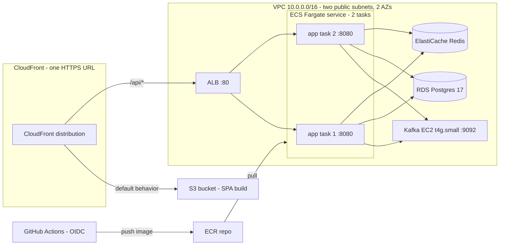

# AWS Deploy Handbook — ticket-reservation (M4) — DETAILED

Prepared 2026-07-28, expanded to click-level 2026-07-28 evening (first AWS deploy — every form spelled out).
Companion files: [decisions.md](decisions.md) (read first) · `artifacts/` (task definition, Kafka user-data, CI workflows, teardown script).

**How to use this:** phases in order; every numbered step is one console action. Values you must type are in **bold**; anything not mentioned in a form = leave the default. Each phase ends with **Verify** (a command or a screen that proves it worked) and **Concept** (the one idea that matters — if the console UI has drifted from these steps, the Concept line is what you're actually trying to achieve; ask in chat when they disagree).

## Console survival rules (read once)

- **The search bar (top, `Alt+S`) is the only navigation you need.** Type the service name, click the first result. Ignore the sea of menus.
- **Check the region (top-right) every time you sit down: `Ohio (us-east-2)`.** Resources are region-scoped; "my cluster vanished" is always the region picker.
- **Name everything `ticketres-*` or exactly as written here** — the teardown script and later steps find things by these names.
- Console wizards change layout every few months. When a screen doesn't match: find the fields named here, leave the rest default, ask in chat if a *required* field isn't covered.
- Nothing before Phase 4 costs money. Phase 4+ bills by the hour — that's why teardown exists.

## Target architecture



The interview sentence: *managed services where state lives (RDS, ElastiCache), self-managed where managed is cost-prohibitive (Kafka — MSK ADR), Fargate ×2 to prove multi-instance, CloudFront two-origin so frontend and API share one HTTPS URL with zero CORS.*

## Security group matrix (built in Phase 3, referenced everywhere)

| SG name | Inbound rule(s) | Source | Purpose |
|---|---|---|---|
| `ticketres-alb-sg` | HTTP 80 | CloudFront managed prefix list `com.amazonaws.global.cloudfront.origin-facing` | Only CloudFront reaches the ALB |
| `ticketres-app-sg` | Custom TCP 8080 | `ticketres-alb-sg` | Only the ALB reaches app tasks |
| `ticketres-kafka-sg` | Custom TCP 9092 | `ticketres-app-sg` | Only app tasks reach the broker |
| `ticketres-db-sg` | PostgreSQL 5432 | `ticketres-app-sg` | Only app tasks reach Postgres |
| `ticketres-redis-sg` | Custom TCP 6379 | `ticketres-app-sg` | Only app tasks reach Redis |

Egress: leave the default allow-all on every SG. Sources are **other SGs, not IPs** — that chain is what makes public subnets defensible.

---

## Phase 0 — Account + guardrails (~45–60 min) — NON-NEGOTIABLE FIRST

### 0.1 Create the account (root)
1. Go to `aws.amazon.com` → **Create an AWS Account**.
2. Root email: **ethaniluong+aws@gmail.com** (the `+aws` makes account mail filterable) · Account name: **ethan-personal**.
3. Verify the email code, set a strong root password (→ password manager as "AWS root").
4. Contact info: **Personal** account type.
5. Card + identity verification (SMS code). Support plan: **Basic (free)**.
6. Sign in to the console as root when it finishes (can take a few minutes).

### 0.2 Set the region
7. Top-right region dropdown → **US East (Ohio) us-east-2**. Do this in every new browser session.

### 0.3 MFA on root, then abandon root
8. Click your account name (top-right) → **Security credentials**.
9. Under Multi-factor authentication → **Assign MFA device** → name **root-mfa** → **Authenticator app** → scan the QR with your phone/password-manager TOTP → enter two consecutive codes → done.

### 0.4 Create the admin IAM user
10. Search bar → **IAM** → left menu **Users** → **Create user**.
11. User name: **ethan-admin** → check **Provide user access to the AWS Management Console** → choose **I want to create an IAM user** (not Identity Center — decisions D9) → **Custom password** → untick "must create new password at next sign-in" → Next.
12. Permissions: **Attach policies directly** → search **AdministratorAccess** → tick it → Next → **Create user**.
13. On the success screen, copy the **Console sign-in URL** (`https://<account-id>.signin.aws.amazon.com/console`) → password manager. You'll log in with it from now on (root never again except emergencies).
14. Users → ethan-admin → **Security credentials** tab → Assign MFA device (same TOTP dance, name **admin-mfa**).

### 0.5 Access key for the CLI
15. Still in ethan-admin → Security credentials → **Create access key** → use case **Command Line Interface (CLI)** → tick the confirmation → Create.
16. Copy **both** the Access key ID and Secret access key into your password manager NOW — the secret is never shown again.

### 0.6 Install + configure the AWS CLI (on this PC)
17. In PowerShell: `winget install Amazon.AWSCLI` (or download the MSI from docs.aws.amazon.com/cli). Open a **new** terminal after install.
18. `aws --version` → should print `aws-cli/2.x`.
19. `aws configure` → paste key id, secret, region **us-east-2**, output **json**.

### 0.7 Budgets — before any resource exists
20. Sign out of root; sign in as **ethan-admin** via the sign-in URL. (Everything from here on = ethan-admin.)
21. Search bar → **Budgets** (under Billing and Cost Management) → **Create budget**.
22. **Use a template** → **Monthly cost budget** → name **monthly-20** → amount **$20** → email **ethaniluong+aws@gmail.com** → Create. (The template auto-alerts at 85% actual and 100% forecast.)
23. Create a second one: template Monthly cost budget → name **tripwire-40** → **$40** → same email.
24. While in Billing: left menu **Billing preferences** → enable **Receive AWS Free Tier usage alerts** → save.

### 0.8 Know the exit
25. Open `docs/aws/artifacts/teardown.sh` and read it top to bottom once. You're not running it — you're learning that "zero the account" is 5 known commands, not a hope.

**Verify:** in your terminal, `aws sts get-caller-identity` → JSON with `"Arn": "arn:aws:iam::<account-id>:user/ethan-admin"`. Post it in chat (the account id is not secret-sensitive, but you can redact it).
**Concept:** root = break-glass only. Every human and every service acts as an IAM *principal* with attached permissions — you just made your first one; ECS tasks and GitHub Actions get theirs later. Same mechanism all the way down.

---

## Phase 1 — Ratify decisions + ADRs (~30 min, in chat)

1. Read [decisions.md](decisions.md) end to end (10 min).
2. In chat, settle: **Q3** (Kafka on t4g.small EC2 — say "ratify P1" or argue), **Q4** (teardown cadence), **Q1** (skip domain for v1).
3. Claude drafts `docs/adr/` entries: **MSK vs self-managed Kafka** (with real numbers off the MSK pricing page) and **public subnets + SG chain vs private subnets + NAT**. You read, push back or ratify. These two ADRs are interview answers — treat the writing as study, not paperwork.

**Concept:** "I chose X over Y because Z, and in prod I'd revisit when W" is the entire senior-signal format. The deploy makes it true; the ADR makes it tellable.

---

## Phase 2 — ECR + first manual push (~30 min)

### 2.1 Create the repository
1. Search → **ECR** → **Repositories** (private) → **Create repository**.
2. Name: **ticket-reservation**. Everything else default → Create.

### 2.2 Build and push by hand (Docker Desktop must be running)
3. Open the new repo → click **View push commands**. It shows 4 commands tailored to your account — use those, they look like:
   - `aws ecr get-login-password --region us-east-2 | docker login --username AWS --password-stdin <account-id>.dkr.ecr.us-east-2.amazonaws.com`
   - `docker build -t ticket-reservation .` ← run from `F:\Claude\projects\ticket-reservation`
   - `docker tag ticket-reservation:latest <account-id>.dkr.ecr.us-east-2.amazonaws.com/ticket-reservation:manual-1` ← use **manual-1**, not latest
   - `docker push <account-id>.dkr.ecr.us-east-2.amazonaws.com/ticket-reservation:manual-1`
4. The push uploads ~10 layers; a few minutes on home upload bandwidth.

**Verify:** ECR repo shows the `manual-1` image, size roughly 200–300 MB.
**Concept:** ECR is a Docker registry where `docker login` is brokered by IAM (that `get-login-password` pipe). The CI pipeline in Phase 9 runs exactly these 4 commands — you'll never wonder what the pipeline "really does."

---

## Phase 3 — VPC + security groups (~45 min)

### 3.1 The VPC (one wizard does everything)
1. Search → **VPC** → **Create VPC** → choose **VPC and more** (the wizard that also builds subnets/routes).
2. Name tag auto-generation: **ticketres** · IPv4 CIDR: **10.0.0.0/16** · IPv6: none.
3. Availability Zones: **2** · Public subnets: **2** · **Private subnets: 0** · **NAT gateways: None** ($32/mo not spent — decisions D3) · VPC endpoints: **None** · DNS options: both boxes stay checked.
4. Create. The preview diagram should show: 1 VPC, 2 public subnets in different AZs, an internet gateway, and route tables sending `0.0.0.0/0` to the IGW.

### 3.2 The five security groups (create in this exact order — later ones reference earlier ones)
Search → **Security groups** (EC2 section) → for each: **Create security group**, VPC = **ticketres-vpc** (not the default VPC!), one inbound rule as below, description = purpose column from the matrix.

5. **ticketres-alb-sg** — inbound: Type **HTTP** (80) · Source: **Custom** → click the field and type `com.amazonaws.global.cloudfront` → pick the managed prefix list **cloudfront.origin-facing** (shows as `pl-…`).
6. **ticketres-app-sg** — inbound: Type **Custom TCP**, port **8080** · Source: Custom → start typing **ticketres-alb-sg** and select it (an SG as a source — this is the chain).
7. **ticketres-kafka-sg** — inbound: Custom TCP **9092** · Source: **ticketres-app-sg**.
8. **ticketres-db-sg** — inbound: Type **PostgreSQL** (5432) · Source: **ticketres-app-sg**.
9. **ticketres-redis-sg** — inbound: Custom TCP **6379** · Source: **ticketres-app-sg**.

**Verify:** VPC dashboard → your VPC → Resource map shows 2 subnets → IGW routes. EC2 → Security groups → the five `ticketres-*` groups exist, and every source is a `pl-` or `sg-` id — no `0.0.0.0/0` anywhere except SG egress.
**Concept:** SG-as-source chains *identity*, not addresses: `app-sg` accepting from `alb-sg` keeps working whatever IPs the ALB lands on. It's also self-documenting — the security model is readable straight off the matrix.

---

## Phase 4 — Stateful layer: RDS, ElastiCache, Kafka EC2 (~1.5 h, half of it waiting)

### 4.1 RDS Postgres
1. Search → **RDS** → **Create database** → **Standard create** → Engine: **PostgreSQL**, version **17.x** (latest 17).
2. Templates: **Free tier** if the option is offered (forces the cheap single-AZ shape). If not: **Dev/Test** → deployment option **Single DB instance**.
3. DB instance identifier: **ticket-reservation-db** (teardown.sh knows this name).
4. Master username: **postgres** · Credentials management: **Self managed** → tick **Auto generate password**.
5. Instance configuration: Burstable classes → **db.t4g.micro**.
6. Storage: **20** GiB, type **gp3** → expand the storage section and **disable storage autoscaling** (a runaway bill vector we don't need).
7. Connectivity: Compute resource **Don't connect to EC2** · VPC: **ticketres-vpc** · DB subnet group: let it create one · Public access: **No** · VPC security group: **Choose existing** → remove default, add **ticketres-db-sg** · AZ: no preference.
8. **Additional configuration** (expand it — this one's buried): Initial database name: **ticketreservation** ← without this no database is created and Flyway has nothing to connect to. Backup retention: 1 day. Untick **Enable Performance Insights** and leave enhanced monitoring off (noise + cost).
9. Create database. **A banner offers "View credential details" — open it and copy the generated password NOW** (single chance). Park it in your password manager; it moves into Parameter Store in Phase 5.
10. Status goes Creating → Available in ~5–10 min. Don't wait — do 4.2 and 4.3 meanwhile. When Available, open the DB and copy its **Endpoint** (like `ticket-reservation-db.xxxx.us-east-2.rds.amazonaws.com`) into a scratch note.

### 4.2 ElastiCache Redis
11. Search → **ElastiCache** → create a cache: engine **Valkey** if offered, else **Redis OSS** (decisions D6).
12. Deployment option: **Design your own cache** → **Cluster cache** → Cluster mode: **Disabled**.
13. Name: **ticket-reservation-redis** · Node type: **cache.t4g.micro** · Number of replicas: **0**.
14. Subnet group: **Create new** → name **ticketres-cache-subnets** → VPC **ticketres-vpc** → select both public subnets.
15. Security: security group **ticketres-redis-sg**. Backups: **disable** (cache holds 10-min TTL seat holds — disposable by design).
16. Create (~5–10 min). When Available: copy the **Primary endpoint** (like `ticket-reservation-redis.xxxx.cache.amazonaws.com:6379`) — note it WITHOUT the `:6379` suffix for later.

### 4.3 Kafka broker EC2 (provisional P1 — ratified in Phase 1)
17. First the SSM role (so you get a shell without SSH keys): IAM → Roles → **Create role** → Trusted entity **AWS service** → use case **EC2** → Next → attach **AmazonSSMManagedInstanceCore** → name **ticketres-kafka-ssm-role** → Create.
18. Search → **EC2** → **Launch instance**:
    - Name: **kafka-broker** ← exactly this; teardown.sh finds the instance by this tag.
    - AMI: **Amazon Linux 2023** · Architecture: **64-bit (Arm)** ← must be Arm, t4g is Graviton.
    - Instance type: **t4g.small**.
    - Key pair: **Proceed without a key pair** (SSM is the shell).
    - Network settings → **Edit**: VPC **ticketres-vpc** · Subnet: either public subnet · Auto-assign public IP: **Enable** (no NAT — it needs to pull the image from Docker Hub) · Firewall: **Select existing security group** → **ticketres-kafka-sg**.
    - Storage: **20** GiB gp3.
    - **Advanced details** (expand): IAM instance profile: **ticketres-kafka-ssm-role** · scroll to the bottom → **User data**: paste the entire contents of `artifacts/kafka-ec2-user-data.sh`.
19. Launch instance. On the instance page copy the **Private IPv4 address** (10.0.x.x) into your scratch note — the app's bootstrap-servers value.

**Verify:** RDS **Available**, ElastiCache **Available**. Kafka: EC2 → instance → Connect → **Session Manager** tab → Connect (takes ~2 min post-launch to register) → in the shell: `sudo docker ps` → the `apache/kafka:4.0.0` container is Up, and `sudo docker logs broker 2>&1 | grep -i started` shows the KRaft server started line.
**Concept:** `ADVERTISED_LISTENERS` is the same dual-listener problem you solved in docker-compose: clients bootstrap to any address but *reconnect to whatever the broker advertises*. The user-data queries the instance metadata service for the private IP and advertises that — stable inside the VPC, reachable from Fargate.

---

## Phase 5 — Secrets + seed (~45 min) — 🎓 yours start-to-finish

### 5.1 Parameters
1. Search → **Systems Manager** → left menu **Parameter Store** → **Create parameter**.
2. Name: **/ticketres/prod/db-password** · Tier: Standard · Type: **SecureString** · KMS: default `alias/aws/ssm` · Value: the RDS password from 4.1 step 9 → Create.
3. Again: name **/ticketres/prod/jwt-secret** · SecureString · value = fresh 64-hex: in Git Bash, `openssl rand -hex 32` → paste → Create. (NOT the dev default — your own `JwtSecretGuard` bricks the boot if it sneaks through, which is exactly the guard doing its job.)

### 5.2 Seed — but AFTER the app's first boot (Phase 6 runs Flyway; the schema must exist first)
Come back to this after Phase 6's verify. Then:
4. RDS → ticket-reservation-db → **Modify** → Connectivity → Public access: **Yes** → Continue → **Apply immediately**.
5. EC2 → Security groups → ticketres-db-sg → **Edit inbound rules** → **Add rule**: PostgreSQL 5432, Source **My IP** → Save.
6. From `F:\Claude\projects\ticket-reservation` in Git Bash (no local psql needed — use the postgres image you already have):
   `docker run -it --rm -v "$(pwd)/scripts:/s" postgres:17-alpine psql -h <RDS_ENDPOINT> -U postgres -d ticketreservation -f /s/dev-seed.sql`
   (password prompt = the Parameter Store value). Keep VIP-1 — the $150 decline demo works in prod.
7. **Undo the exposure**: remove the My-IP rule from ticketres-db-sg, and Modify → Public access: **No** → apply immediately.

**Verify:** `aws ssm get-parameter --name /ticketres/prod/jwt-secret --with-decryption --query Parameter.Value --output text` prints your secret (you're admin). After seeding: the psql run ends with INSERT counts and no errors.
**Concept:** a SecureString is a KMS-encrypted value; the *entire* security story is who's allowed to decrypt. You can because you're admin; the ECS task execution role will be allowed `ssm:GetParameters` on `/ticketres/prod/*` and nothing else — least privilege in one policy line.

---

## Phase 6 — ECS: roles, task definition, ALB, service (~1.5–2 h) — the core phase

### 6.1 CloudWatch log group (30 seconds, avoids an IAM edge later)
1. Search → **CloudWatch** → Log groups → **Create log group** → name **/ecs/ticket-reservation** → Create.

### 6.2 The two IAM roles
2. IAM → Roles → **Create role** → AWS service → use case: pick **Elastic Container Service** then **Elastic Container Service Task** → Next → attach **AmazonECSTaskExecutionRolePolicy** → name **ecsTaskExecutionRole** → Create. (If the role already exists, just proceed to step 3.)
3. Open ecsTaskExecutionRole → Permissions → **Add permissions → Create inline policy** → JSON tab → paste:
```json
{
  "Version": "2012-10-17",
  "Statement": [{
    "Effect": "Allow",
    "Action": ["ssm:GetParameters"],
    "Resource": "arn:aws:ssm:us-east-2:<ACCOUNT_ID>:parameter/ticketres/prod/*"
  }]
}
```
   (replace `<ACCOUNT_ID>`; it's in the top-right account menu) → name **ticketres-read-params** → Create.
4. Second role: Create role → same "Elastic Container Service Task" trust → attach **nothing** → name **ticket-reservation-task-role**. (This is who the *running app* is; it calls no AWS APIs today, so it's empty — that's a feature.)

### 6.3 Register the task definition (JSON, not the form wizard)
5. Open `artifacts/task-def-app.json` in your editor and fill every `<PLACEHOLDER>`:
   - `<ACCOUNT_ID>` (×3: two role ARNs, image URI)
   - image tag: keep **:manual-1**
   - `<RDS_ENDPOINT>` · `<ELASTICACHE_ENDPOINT>` (host only, the URL already has `:6379`) · `<KAFKA_EC2_PRIVATE_IP>`
6. Search → **ECS** → Task definitions → **Create new task definition with JSON** → replace the sample with your filled JSON → Create. It should save as **ticket-reservation-app : 1**.

### 6.4 Target group, then ALB
7. Search → **Target groups** (EC2 section) → **Create target group**: Target type **IP addresses** · Name **ticket-app-tg** · Protocol **HTTP**, Port **8080** · VPC **ticketres-vpc** · Health check path **/actuator/health** → expand Advanced health check settings → Healthy threshold **2** → Next → register NO targets (ECS does that) → Create.
8. Search → **Load balancers** → **Create load balancer** → **Application Load Balancer**: Name **ticket-alb** · Internet-facing · IPv4 · Network mapping: **ticketres-vpc** + tick **both** subnets · Security groups: remove default, select **ticketres-alb-sg** · Listener HTTP **80** → forward to **ticket-app-tg** → Create.

### 6.5 Cluster + service
9. ECS → Clusters → **Create cluster** → name **ticket-reservation** → infrastructure: Fargate only (default) → Create.
10. Open the cluster → Services → **Create**:
    - Compute options: **Launch type** → FARGATE.
    - Deployment configuration: Family **ticket-reservation-app**, revision latest · Service name **ticket-reservation-app** · **Desired tasks: 2**.
    - Networking: VPC **ticketres-vpc** · Subnets: both public · Security group: **ticketres-app-sg** · Public IP: **Turned on** ← the no-NAT tradeoff; it's how tasks pull the image.
    - Load balancing: type **Application Load Balancer** → **Use an existing load balancer** → ticket-alb → existing listener **80:HTTP** → existing target group **ticket-app-tg**.
    - Create service.
11. Watch it come up (5–10 min): cluster → service → **Deployments** and **Events** tabs; CloudWatch → /ecs/ticket-reservation → two log streams appear — first boot runs Flyway (you'll see the migrations), then `Started TicketReservationApplication`. Target group → Targets tab → both targets **healthy**.
12. If a task cycles: read its **Stopped reason** (cluster → tasks → include Stopped) + its log stream — paste both in chat. Common first-boot culprits: a wrong endpoint placeholder, secret ARN typo, or the SG chain missing a link.
13. Now do **Phase 5.2 (seed)**, then check the logs again — no errors on the next poll cycles.

**Verify:** 2/2 targets healthy. Optional direct check: temporarily add inbound HTTP 80 **My IP** to ticketres-alb-sg → `curl http://<alb-dns>/actuator/health` → `{"status":"UP"}` → **remove that rule again** (CloudFront's prefix list is the only permanent source).
**Concept:** task definition = the contract (image, cpu/mem, env, secrets, logs); service = the promise (keep N running, registered in this target group); Fargate = nobody manages the EC2 underneath. Two tasks behind one ALB is the M3 multi-instance story running live — Redisson locks and the partial unique index are now doing real cross-JVM work.

---

## Phase 7 — Frontend: S3 + CloudFront (~45 min)

### 7.1 Bucket + build upload
1. Search → **S3** → **Create bucket** → name **ticketres-web-<yourinitials><random4>** (globally unique, e.g. `ticketres-web-el7291`) · Region us-east-2 · **Block all public access stays ON** (CloudFront will be the only reader) → Create.
2. Build + upload from `frontend/`: `npm run build` (no `VITE_API_BASE` — same-origin default is exactly what the two-origin trick needs), then `aws s3 sync dist/ s3://<bucket-name>`.

### 7.2 CloudFront distribution
3. Search → **CloudFront** → **Create distribution**:
   - Origin 1: Origin domain → pick your **S3 bucket** from the dropdown · Origin access: **Origin access control settings** → **Create new OAC** (defaults) → after selecting it, note the banner: CloudFront shows a **bucket policy to copy** — click through and let it apply (or copy-paste it into S3 → bucket → Permissions → Bucket policy).
   - Default cache behavior: Viewer protocol policy **Redirect HTTP to HTTPS**. Web Application Firewall: **Do not enable** (cost).
   - Settings: Default root object **index.html**.
   - Create (don't wait for deploy yet).
4. Open the distribution → **Origins** tab → **Create origin**: Origin domain → pick **ticket-alb** (dualstack…elb.amazonaws.com) · Protocol: **HTTP only** → Create.
5. **Behaviors** tab → **Create behavior**: Path pattern **/api/*** · Origin: the ALB origin · Viewer protocol policy **Redirect HTTP to HTTPS** · **Allowed HTTP methods: GET, HEAD, OPTIONS, PUT, POST, PATCH, DELETE** ← without this every reserve/login POST bounces · Cache policy: **CachingDisabled** · Origin request policy: **AllViewerExceptHostHeader** ← forwards the JWT Authorization header and query strings, but not the Host header (which would confuse the ALB) → Create.
6. **Error pages** tab → Create custom error response ×2: HTTP error code **403** → Customize response → Response page path **/index.html** → HTTP response code **200**; same for **404**. (SPA fallback for BrowserRouter deep links.)
7. Wait for the distribution to leave "Deploying" (~5–10 min).

**Verify — the big one:** open `https://<dist-id>.cloudfront.net` → the app loads → register → log in → reserve a $50 seat → **CONFIRMED within ~2 s** → reserve VIP-1 → declined → **CANCELLED**. That's the entire system — React → CloudFront → ALB → 2 Fargate tasks → Redis holds → Kafka saga → payment → back. **Screenshot it for the README.**
**Concept:** the browser sees ONE origin (cloudfront.net), so there is no CORS anywhere; CloudFront routes by path behind the curtain. This is also why the frontend build needed no env var — same-origin `fetch('/api/…')` just works.

---

## Phase 8 — Observability floor (~45 min)

1. CloudWatch → Log groups → /ecs/ticket-reservation: watch one saga complete across **two different task streams** — your first real "grep across instances" moment.
2. CloudWatch → Dashboards → **Create dashboard** `ticket-reservation` → add line widgets:
   - ApplicationELB: `RequestCount`, `HTTPCode_Target_5XX_Count`, `TargetResponseTime` (pick ticket-alb).
   - ECS: `CPUUtilization`, `MemoryUtilization` (cluster/service dims).
   - RDS: `DatabaseConnections`, `FreeStorageSpace` (ticket-reservation-db).
3. Alarms (CloudWatch → Alarms → Create): ALB `HTTPCode_Target_5XX_Count` Sum > **10** over 5 min · RDS `FreeStorageSpace` < **2 GB**. In the alarm wizard, create a new SNS topic **ticketres-alarms** with your email — **confirm the subscription email** it sends or alarms go nowhere.

**Concept:** logs from N instances into one group per service + a handful of alarms on user-facing symptoms (5xx) and finite resources (disk, connections) is the whole observability floor. Structured JSON + correlation ids (M3 item) is the next rung, and now you'll feel *why*.

---

## Phase 9 — CI/CD: GitHub OIDC + Actions (~1.5 h)

### 9.1 Trust GitHub
1. IAM → **Identity providers** → **Add provider** → **OpenID Connect** · Provider URL **https://token.actions.githubusercontent.com** → click Get thumbprint · Audience **sts.amazonaws.com** → Add.

### 9.2 The deploy role
2. IAM → Roles → Create role → **Web identity** → provider: the one from step 1 · Audience sts.amazonaws.com · GitHub organization: **EthanLuong** · repository: **ticket-reservation** · branch: **main** → Next.
3. Skip attaching managed policies → name **github-deploy** → Create. Open it → add this inline policy (name **ticketres-deploy**), `<ACCOUNT_ID>`/`<BUCKET>`/`<DIST_ID>` filled:
```json
{
  "Version": "2012-10-17",
  "Statement": [
    { "Effect": "Allow", "Action": "ecr:GetAuthorizationToken", "Resource": "*" },
    { "Effect": "Allow",
      "Action": ["ecr:BatchCheckLayerAvailability","ecr:PutImage","ecr:InitiateLayerUpload","ecr:UploadLayerPart","ecr:CompleteLayerUpload","ecr:BatchGetImage","ecr:GetDownloadUrlForLayer"],
      "Resource": "arn:aws:ecr:us-east-2:<ACCOUNT_ID>:repository/ticket-reservation" },
    { "Effect": "Allow",
      "Action": ["ecs:DescribeTaskDefinition","ecs:RegisterTaskDefinition","ecs:UpdateService","ecs:DescribeServices"],
      "Resource": "*" },
    { "Effect": "Allow", "Action": "iam:PassRole",
      "Resource": ["arn:aws:iam::<ACCOUNT_ID>:role/ecsTaskExecutionRole","arn:aws:iam::<ACCOUNT_ID>:role/ticket-reservation-task-role"] },
    { "Effect": "Allow", "Action": ["s3:ListBucket","s3:PutObject","s3:DeleteObject","s3:GetObject"],
      "Resource": ["arn:aws:s3:::<BUCKET>","arn:aws:s3:::<BUCKET>/*"] },
    { "Effect": "Allow", "Action": "cloudfront:CreateInvalidation",
      "Resource": "arn:aws:cloudfront::<ACCOUNT_ID>:distribution/<DIST_ID>" }
  ]
}
```

### 9.3 Activate the workflows
4. Copy `docs/aws/artifacts/deploy-backend.yml` and `deploy-frontend.yml` into `.github/workflows/`.
5. Fill the `env:` placeholders: role ARN (from step 3), cluster/service names, bucket, distribution id.
6. Commit to main, push, watch the Actions tab: test → build → ECR push → new task-def revision → `ecs update-service` → rolling replacement behind the ALB with zero downtime (watch the target group during it — old tasks drain as new ones go healthy).

**Verify:** push a trivial README change → both workflows green → ECS service shows a new task definition revision running.
**Concept:** OIDC = GitHub proves "I am a workflow on main of EthanLuong/ticket-reservation" with a short-lived signed token; AWS trades it for temporary credentials scoped to that role. No stored keys anywhere — nothing to leak, nothing to rotate. This replaces the access-keys-in-repo-secrets pattern that gets people breached, and it's a resume line.

---

## Phase 10 — Finish line (~30 min)

1. README: live URL, updated architecture diagram, links to the two ADRs, the CONFIRMED/CANCELLED screenshots.
2. One paragraph of interview notes per phase (feeds the M5 interview pack).
3. **Run `artifacts/teardown.sh` once as a drill**, then redeploy Phase 4+6 from this handbook. Reproducibility proven — the cadence decision (P2) is now real, not aspirational.

---

## Cost sheet (always-on, us-east-2, no free tier)

| Item | $/mo |
|---|---|
| Fargate 2 × (0.5 vCPU / 1 GB) | ~36 |
| Kafka t4g.small + 20 GB EBS | ~14 |
| ALB | ~17 |
| RDS db.t4g.micro + 20 GB | ~14 (0 first year w/ free tier) |
| ElastiCache cache.t4g.micro | ~12 |
| S3 + CloudFront + data | ~1 |
| **Total** | **~80–95** (≈ 65–80 w/ free tier) |

Phases 0–3 cost $0. The $20 budget fires early *by design* — teardown between sessions is the plan (P2).

## Session plan

| Session (~2–3 h) | Phases | You walk away with |
|---|---|---|
| 1 | 0 + 1 + 2 | account with guardrails, ratified decisions, image in ECR |
| 2 | 3 + 4 | network + all three stateful services up |
| 3 | 5 + 6 | secrets wired, app healthy behind the ALB |
| 4 | 7 + 8 | **live HTTPS URL**, dashboard + alarms |
| 5 | 9 + 10 | pipeline, README, teardown drill |

Stopping >a day? Run teardown (keeps: ECR, S3, CloudFront, params, IAM, VPC — redeploy is Phases 4+6, ~30 min).
